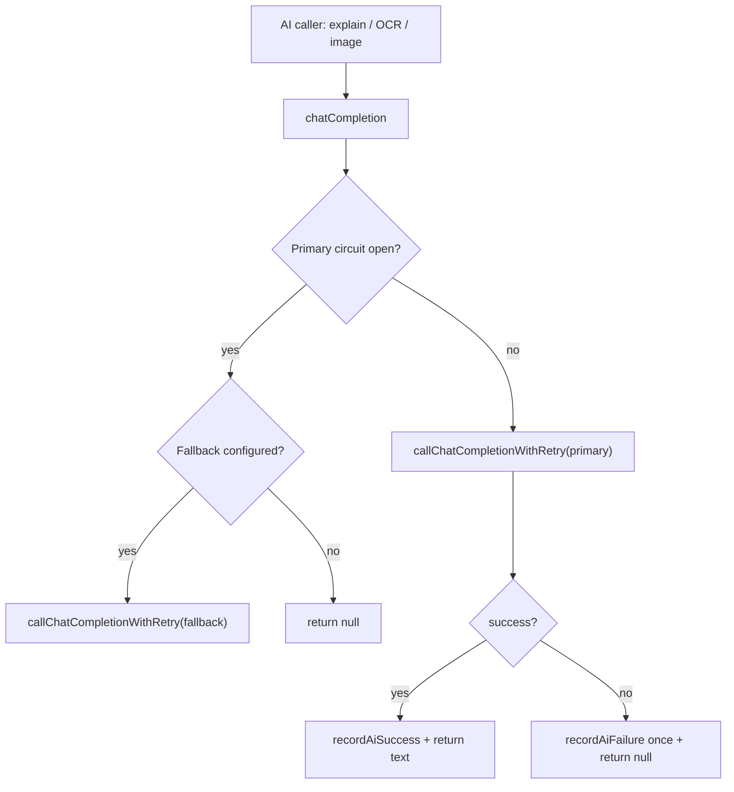

# Design: AI Provider Resilience v1

## Overview

The change is intentionally small and centralized in `src/lib/risk/check-core.ts`. The current `chatCompletion` helper is the only AI gateway used by text explanations, OCR, and image intelligence. Adding retry there improves all AI paths while preserving the rules-first contract.

## Architecture

## Components

- `isTransientAiStatus(status)`: returns true for 429, 500, 502, 503, 504.
- `AI_MAX_ATTEMPTS`: three total attempts: initial request plus two retries.
- `AI_RETRY_BACKOFF_MS`: short deterministic backoff values for tests and bounded latency.
- `callChatCompletionWithRetry(cfg, messages, label)`: performs one sanitized AI call loop and returns `{ ok, text }`.
- `chatCompletion(messages, label)`: keeps circuit breaker semantics and delegates to the retry helper.

## Correctness Properties

1. Retryable statuses may be attempted up to three times.
2. Non-retryable statuses are attempted exactly once.
3. No failure path throws to callers.
4. A successful retry is equivalent to first-attempt success for callers.
5. Failure logging never includes prompt or response body content.

## Error Handling

Network throws and aborts are treated as transient attempt failures. After all attempts fail, the helper returns `null`; caller behavior stays unchanged.

## Testing Strategy

Use existing AI degradation integration tests. Add cases for 503 then 200, 401 no retry, and repeated 503 safe degradation.
