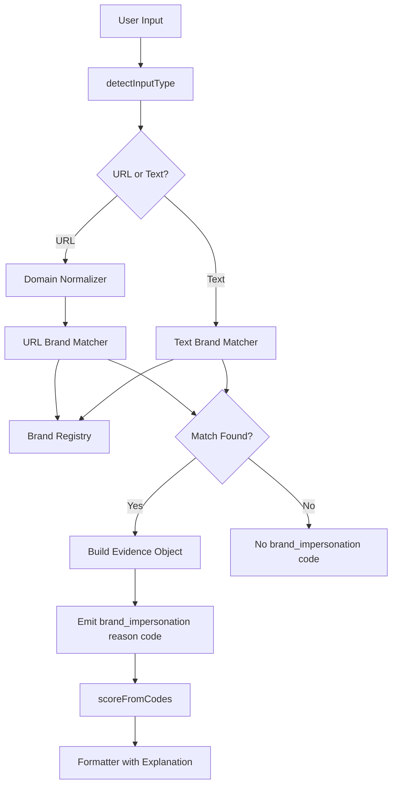

# Design Document: Brand Impersonation Detector

## Overview

The Brand Impersonation Detector is a new module integrated into the Ishonch Guard risk engine that identifies URLs and text attempting to impersonate known Uzbek brands. It introduces a structured Brand Registry, a Brand Matcher for URL and text analysis, a Domain Normalizer for preprocessing, and produces a structured Evidence Object for downstream consumers. The module emits a `brand_impersonation` reason code (weight 40) and provides trilingual user-facing explanations naming the impersonated brand and its official domain.

### Design Goals

1. **High detection accuracy** — Catch impersonation attempts across hostnames, paths, and text with typosquat awareness.
2. **Low false positive rate** — Avoid triggering on legitimate brand mentions, official domains/subdomains, news sites, and generic brand names in common phrases.
3. **Consistency with existing architecture** — Follow the same pattern as existing rule evaluators (`evaluateUrl`, `evaluateText`) and integrate seamlessly with `scoreFromCodes` and the formatter pipeline.
4. **Maintainability** — The Brand Registry references organization names from the existing Verified Contacts module and is easy to extend with new brands.
5. **Structured output** — Return an Evidence Object for downstream consumers (Telegram bot, web UI, admin panel) rather than requiring free-text parsing.

## Architecture



### Integration Points

The Brand Impersonation Detector plugs into the existing `runCheck` pipeline in `check-core.ts`:

1. After `evaluateUrl()` and `evaluateText()` are called, the new `evaluateBrandImpersonation()` function runs.
2. It receives the normalized URL (if present) and the raw text input.
3. It returns zero or more `brand_impersonation` reason codes plus Evidence Objects.
4. The Evidence Objects are passed to the formatter for explanation generation.
5. The `brand_impersonation` code participates in `scoreFromCodes` with weight 40.

## Components and Interfaces

### 1. Brand Registry (`src/lib/risk/brand-registry.ts`)

A static, in-memory registry of protected brands. Each entry contains:

```typescript
export type OrgCategory = "bank" | "payment_system" | "telecom" | "government";

export interface BrandEntry {
  /** Unique brand identifier (e.g., "kapitalbank", "payme") */
  id: string;
  /** Canonical display name in three languages */
  name: { ru: string; uz: string; en: string };
  /** Organization category */
  category: OrgCategory;
  /** Official domains (at least one required) */
  officialDomains: string[];
  /**
   * All known name variants: canonical, transliterations, common typosquats.
   * Stored lowercase for matching.
   */
  aliases: string[];
  /** Whether this brand has a generic name requiring stricter matching */
  isGenericName: boolean;
}
```

The registry is exported as a `readonly BrandEntry[]` array and provides a lookup function `findBrandByAlias(alias: string): BrandEntry | null`.

### 2. Domain Normalizer (`src/lib/risk/domain-normalizer.ts`)

Preprocesses domains before matching:

```typescript
export interface NormalizedDomain {
  /** Fully normalized hostname (lowercase, no protocol/www, punycode decoded, homoglyphs replaced) */
  hostname: string;
  /** Path component (lowercase) */
  path: string;
}

export function normalizeDomain(rawUrl: string): NormalizedDomain;
```

Steps:

1. Strip protocol scheme (`http://`, `https://`)
2. Strip `www.` prefix
3. Lowercase all characters
4. Decode Punycode/IDNA segments to Unicode
5. Apply homoglyph normalization (Cyrillic а→a, l→I substitution reversal, 0→o, 1→l)

### 3. Brand Matcher (`src/lib/risk/brand-matcher.ts`)

The core detection logic:

```typescript
export interface BrandEvidence {
  brandId: string;
  brandName: string;
  matchedAlias: string;
  matchedIn: "hostname" | "path" | "text";
  checkedDomain: string;
  officialDomains: string[];
  confidence: "medium" | "high";
}

export interface BrandMatchResult {
  detected: boolean;
  evidence: BrandEvidence[];
}

/** Evaluate a URL for brand impersonation */
export function matchBrandInUrl(
  normalizedUrl: NormalizedDomain,
  rawHostname: string,
): BrandMatchResult;

/** Evaluate text for brand impersonation (requires presence of URL or other risk signals) */
export function matchBrandInText(
  text: string,
  urls: string[],
  otherReasonCodes: ReasonCode[],
): BrandMatchResult;
```

#### URL Matching Logic

1. Normalize the domain using `Domain Normalizer`
2. For each brand in the registry:
   a. Check if the hostname matches any official domain (exact or subdomain) → skip (legitimate)
   b. Check if any brand alias appears in the hostname segments (split by `.` and `-`)
   c. Check if any brand alias appears in the URL path
   d. For generic brand names: only match if alias is an exact segment in hostname/subdomain
3. If a match is found and the domain is NOT official → build Evidence Object

#### Text Matching Logic

1. Scan text for brand name mentions (with word boundary detection)
2. Extract URLs from text
3. If brand is mentioned AND:
   - A URL is present that doesn't belong to the brand's official domains, OR
   - Other high-risk reason codes are present (e.g., `asks_for_otp`, `asks_for_card_cvv`)
4. For generic brand names: require accompanying payment/card/login/verify keywords or URL context

#### Official Domain Validation

A hostname is considered official for a brand if:

- It exactly matches an official domain, OR
- It ends with `.` + official domain (i.e., is a subdomain)

A hostname that contains the official domain as a substring but does NOT satisfy the above (e.g., `kapitalbank.uz.evil.com`) is NOT treated as official.

### 4. False Positive Suppression

**Word Boundary Detection**: Brand names must match at word boundaries (split on `-`, `.`, `/`, whitespace) to avoid false matches within unrelated words.

**Generic Brand Handling**: Brands like "Click" and "Payme" whose names coincide with common words require:

- In URLs: exact segment match in hostname or subdomain
- In text: must appear alongside card/OTP/payment/login/verify keywords or a suspicious URL

**News Domain Whitelist**: A configurable list of known news/media domains (e.g., `gazeta.uz`, `spot.uz`, `kun.uz`) that suppress brand impersonation detection when brand names appear in their paths.

### 5. Risk Scoring Integration

The `brand_impersonation` reason code is added to the `ReasonCode` type and `WEIGHTS` record with weight 40.

**High-risk escalation rules** (combined score ≥ 50):

- `brand_impersonation` (40) + support/login/verify/security keywords in URL path → high_risk
- `brand_impersonation` (40) + hosted on public platform (lovable.app, vercel.app, etc.) → high_risk
- `brand_impersonation` (40) + OTP/PIN/CVV/card keywords in text → high_risk
- `brand_impersonation` (40) + suspicious redirect/URL shortener → high_risk

**Note**: `brand_impersonation` alone (40) does NOT exceed the high_risk threshold (50), classifying as `suspicious` by itself, which aligns with the requirement that it should not be high_risk in isolation.

### 6. Formatter Integration

The existing formatter receives the Evidence Object and renders explanations:

```typescript
export function formatBrandImpersonationExplanation(
  evidence: BrandEvidence,
  lang: Lang,
  verifiedCallbackNumber?: string,
): string;
```

Templates:

- **RU**: "Похоже на имитацию {brandName}. Ссылка использует название бренда, но домен не совпадает с официальным. Официальный сайт: {officialDomain}"
- **UZ**: "{brandName} ga o'xshash taqlid aniqlandi. Havola brend nomini ishlatadi, lekin domen rasmiy domenga mos kelmaydi. Rasmiy sayt: {officialDomain}"
- **EN**: "Possible {brandName} impersonation detected. The link uses the brand name, but the domain does not match the official one. Official site: {officialDomain}"

When a verified callback number is available, it is appended to the explanation.

## Data Models

### Brand Registry Data

```typescript
// Initial brands (minimum set per Requirement 1.3)
const BRAND_REGISTRY: readonly BrandEntry[] = [
  {
    id: "kapitalbank",
    name: { ru: "Капиталбанк", uz: "Kapitalbank", en: "Kapitalbank" },
    category: "bank",
    officialDomains: ["kapitalbank.uz"],
    aliases: ["kapitalbank", "капиталбанк", "kapitolbank", "kapitalbenk", "kapitalbnk"],
    isGenericName: false,
  },
  {
    id: "nbu",
    name: {
      ru: "Национальный банк Узбекистана",
      uz: "O'zbekiston Milliy banki",
      en: "National Bank of Uzbekistan",
    },
    category: "bank",
    officialDomains: ["nbu.uz"],
    aliases: ["nbu", "milliybank", "национальныйбанк"],
    isGenericName: false,
  },
  {
    id: "ipak-yuli",
    name: { ru: "Ипак Йули Банк", uz: "Ipak Yo'li Banki", en: "Ipak Yuli Bank" },
    category: "bank",
    officialDomains: ["ipakyulibank.uz"],
    aliases: ["ipakyuli", "ipak-yuli", "ipakyulibank", "ипакйули"],
    isGenericName: false,
  },
  {
    id: "anorbank",
    name: { ru: "АНОР Банк", uz: "ANOR Bank", en: "ANOR Bank" },
    category: "bank",
    officialDomains: ["anorbank.uz"],
    aliases: ["anorbank", "anor", "анорбанк"],
    isGenericName: false,
  },
  {
    id: "aloqabank",
    name: { ru: "Алокабанк", uz: "Aloqabank", en: "Aloqabank" },
    category: "bank",
    officialDomains: ["aloqabank.uz"],
    aliases: ["aloqabank", "aloqa", "алокабанк"],
    isGenericName: false,
  },
  {
    id: "uzcard",
    name: { ru: "UZCARD", uz: "UZCARD", en: "UZCARD" },
    category: "payment_system",
    officialDomains: ["uzcard.uz"],
    aliases: ["uzcard", "юзкард"],
    isGenericName: false,
  },
  {
    id: "humo",
    name: { ru: "HUMO", uz: "HUMO", en: "HUMO" },
    category: "payment_system",
    officialDomains: ["humocard.uz"],
    aliases: ["humo", "humocard", "хумо"],
    isGenericName: false,
  },
  {
    id: "payme",
    name: { ru: "Payme", uz: "Payme", en: "Payme" },
    category: "payment_system",
    officialDomains: ["payme.uz"],
    aliases: ["payme", "пэйми"],
    isGenericName: true, // "pay me" is a common English phrase
  },
  {
    id: "click",
    name: { ru: "Click", uz: "Click", en: "Click" },
    category: "payment_system",
    officialDomains: ["click.uz"],
    aliases: ["click", "клик"],
    isGenericName: true, // "click" is a common English word
  },
  {
    id: "ucell",
    name: { ru: "Ucell", uz: "Ucell", en: "Ucell" },
    category: "telecom",
    officialDomains: ["ucell.uz"],
    aliases: ["ucell", "юсел", "юселл"],
    isGenericName: false,
  },
  {
    id: "beeline-uz",
    name: { ru: "Beeline Uzbekistan", uz: "Beeline Uzbekistan", en: "Beeline Uzbekistan" },
    category: "telecom",
    officialDomains: ["beeline.uz"],
    aliases: ["beeline", "билайн"],
    isGenericName: false,
  },
  {
    id: "mobiuz",
    name: { ru: "Mobiuz", uz: "Mobiuz", en: "Mobiuz" },
    category: "telecom",
    officialDomains: ["mobiuz.uz"],
    aliases: ["mobiuz", "uzmobile", "мобиуз"],
    isGenericName: false,
  },
  {
    id: "mvd",
    name: { ru: "МВД Узбекистана", uz: "O'zbekiston IIV", en: "Ministry of Internal Affairs" },
    category: "government",
    officialDomains: ["iiv.uz"],
    aliases: ["mvd", "мвд", "iiv"],
    isGenericName: false,
  },
  {
    id: "tax-authority",
    name: { ru: "Налоговый комитет", uz: "Soliq qo'mitasi", en: "Tax Authority" },
    category: "government",
    officialDomains: ["soliq.uz"],
    aliases: ["soliq", "налоговая", "солик"],
    isGenericName: false,
  },
];
```

### Evidence Object Structure

```typescript
interface BrandEvidence {
  brandId: string; // "kapitalbank"
  brandName: string; // "Kapitalbank" (canonical display name in detected lang)
  matchedAlias: string; // "kapitalbank" or "kapitolbank" (the actual string matched)
  matchedIn: "hostname" | "path" | "text";
  checkedDomain: string; // "kapitalbank-support.lovable.app"
  officialDomains: string[]; // ["kapitalbank.uz"]
  confidence: "medium" | "high"; // "high" for exact match, "medium" for typosquat/partial
}
```

### News Domain Whitelist

```typescript
const NEWS_DOMAIN_WHITELIST: string[] = [
  "gazeta.uz",
  "spot.uz",
  "kun.uz",
  "daryo.uz",
  "podrobno.uz",
  "kommersant.uz",
  "review.uz",
  "nuz.uz",
];
```

### Hosted App Domains (existing, reused)

The existing `HOSTED_APP_DOMAINS` array in `rules.ts` is reused for the high-risk escalation check.

## Correctness Properties

_A property is a characteristic or behavior that should hold true across all valid executions of a system—essentially, a formal statement about what the system should do. Properties serve as the bridge between human-readable specifications and machine-verifiable correctness guarantees._

### Property 1: Brand alias in non-official domain triggers detection

_For any_ brand in the registry and _for any_ alias of that brand, when the alias appears as a segment (split by `.` or `-`) in a hostname that is NOT an official domain or subdomain of one, the Brand Matcher SHALL emit the `brand_impersonation` reason code identifying that brand.

**Validates: Requirements 2.1, 2.2, 2.3, 2.5**

### Property 2: Official domain or subdomain never triggers detection

_For any_ brand in the registry and _for any_ official domain of that brand, a URL whose hostname either exactly matches the official domain OR ends with "." + official domain SHALL NOT produce a `brand_impersonation` reason code.

**Validates: Requirements 2.4, 2.6, 6.1**

### Property 3: Official domain as substring without suffix triggers detection

_For any_ brand official domain, when a hostname contains the official domain as a substring but does NOT end with it (e.g., `brand.uz.evil.com`, `brand-uz.com`), the Brand Matcher SHALL emit the `brand_impersonation` reason code.

**Validates: Requirements 2.7**

### Property 4: Text with brand name and non-official URL triggers detection

_For any_ non-generic brand name and _for any_ URL that does not belong to that brand's official domain list, when both appear in the same text input, the Brand Matcher SHALL emit the `brand_impersonation` reason code.

**Validates: Requirements 3.1**

### Property 5: Brand name in plain text without URL or risk signals does not trigger

_For any_ brand name mentioned in text that contains no URLs and no other high-risk reason codes, the Brand Matcher SHALL NOT emit the `brand_impersonation` reason code.

**Validates: Requirements 3.2, 6.2**

### Property 6: News domain whitelist suppresses detection

_For any_ brand alias and _for any_ domain in the news domain whitelist, when the brand alias appears only in the URL path on that domain, the Brand Matcher SHALL NOT emit the `brand_impersonation` reason code.

**Validates: Requirements 6.3**

### Property 7: Word boundary detection prevents substring false matches

_For any_ brand alias, when the alias appears only as a strict substring within a larger word (not at a word boundary defined by `-`, `.`, `/`, or whitespace), the Brand Matcher SHALL NOT emit the `brand_impersonation` reason code.

**Validates: Requirements 6.4**

### Property 8: Generic brand name in normal conversation does not trigger

_For any_ generic brand name (e.g., "click", "payme") and _for any_ conversational phrase not containing URLs, payment/card/OTP/login/verify keywords, or hostname context, the Brand Matcher SHALL NOT emit the `brand_impersonation` reason code.

**Validates: Requirements 6.5**

### Property 9: Generic brand name in hostname or with suspicious keywords triggers detection

_For any_ generic brand name, when the brand name appears as an exact segment in a URL hostname or subdomain, OR appears in text alongside card/OTP/payment/login/verify keywords with a non-official URL, the Brand Matcher SHALL emit the `brand_impersonation` reason code.

**Validates: Requirements 6.6**

### Property 10: Formatter explanation contains brand name and official domain in all languages

_For any_ BrandEvidence object and _for any_ language (ru, uz, en), the formatted explanation string SHALL contain the brand's display name and at least one official domain.

**Validates: Requirements 5.1, 5.2, 5.3, 5.4**

### Property 11: Multiple brand detections produce multiple explanations

_For any_ list of N distinct BrandEvidence objects (N ≥ 1), the formatter SHALL produce exactly N explanation strings, one per detected brand.

**Validates: Requirements 5.5**

### Property 12: Evidence matchedIn field accurately reflects detection location

_For any_ detected impersonation, if the brand alias was found in the hostname the Evidence Object SHALL have matchedIn = "hostname"; if found in the path, matchedIn = "path"; if found in text (not within a URL), matchedIn = "text".

**Validates: Requirements 9.2, 9.3, 9.4**

### Property 13: Evidence confidence reflects match type

_For any_ detected impersonation, if the matched alias is a canonical/exact brand name then confidence SHALL be "high"; if the matched alias is a typosquat variant or partial match then confidence SHALL be "medium".

**Validates: Requirements 9.5, 9.6**

### Property 14: Domain normalization produces lowercase output with no protocol or www prefix

_For any_ input URL string, after domain normalization the resulting hostname SHALL be entirely lowercase, contain no protocol scheme (`http://`, `https://`), and have no `www.` prefix.

**Validates: Requirements 10.1, 10.2**

### Property 15: Homoglyph normalization maps known substitutions

_For any_ domain containing Cyrillic `а` (→ `a`), digit `0` (→ `o`), or digit `1` (→ `l`) in place of their Latin counterparts, domain normalization SHALL produce the Latin equivalent, ensuring brand detection is not bypassed by character substitution.

**Validates: Requirements 10.4**

## Error Handling

### Input Validation Errors

| Error Condition                               | Handling Strategy                                                                             | User Impact                                                                      |
| --------------------------------------------- | --------------------------------------------------------------------------------------------- | -------------------------------------------------------------------------------- |
| Malformed URL (cannot parse)                  | Return empty BrandMatchResult (no detection), let existing `weird_domain` rule handle scoring | No false positive from brand matcher; existing rules still flag suspicious input |
| Empty input string                            | Short-circuit: return no detection                                                            | No impact                                                                        |
| URL with no hostname (e.g., `file://` scheme) | Skip brand matching, return empty result                                                      | No impact                                                                        |

### Registry Errors

| Error Condition                       | Handling Strategy                                                         | User Impact                                 |
| ------------------------------------- | ------------------------------------------------------------------------- | ------------------------------------------- |
| Brand entry missing `officialDomains` | Validation at build/load time; entry rejected if officialDomains is empty | None at runtime (caught during development) |
| Duplicate brand IDs in registry       | Validation at build/load time; throw error                                | None at runtime                             |

### Normalization Errors

| Error Condition                             | Handling Strategy                                      | User Impact                                                                         |
| ------------------------------------------- | ------------------------------------------------------ | ----------------------------------------------------------------------------------- |
| Punycode decode failure (invalid encoding)  | Fall back to the raw ASCII representation for matching | Detection still works on raw form; may miss some homoglyph attacks but avoids crash |
| Homoglyph map encounters unmapped character | Pass character through unchanged                       | Graceful degradation — most common homoglyphs are covered                           |

### Matching Errors

| Error Condition                     | Handling Strategy                                                                                                                   | User Impact                                                                |
| ----------------------------------- | ----------------------------------------------------------------------------------------------------------------------------------- | -------------------------------------------------------------------------- |
| Regex timeout on pathological input | Avoid regex for segment matching; use string splitting + includes. If a match operation takes > 50ms, short-circuit to no detection | No crash; possible missed detection on adversarial input (low probability) |
| Multiple brands match the same URL  | Return ALL matching brands in the evidence array                                                                                    | User sees explanations for each impersonated brand                         |

### Integration Errors

| Error Condition                              | Handling Strategy                                                                | User Impact                                             |
| -------------------------------------------- | -------------------------------------------------------------------------------- | ------------------------------------------------------- |
| Verified Contacts module unavailable         | Omit verified callback number from explanation; proceed with detection           | Slightly less helpful explanation; no functional impact |
| Formatter receives malformed Evidence Object | Log warning, produce fallback generic explanation without brand-specific details | User still sees a warning, just less specific           |

### Graceful Degradation Principle

The brand impersonation detector follows the same graceful degradation pattern as the rest of the risk engine:

- If brand detection fails for any reason, the pipeline continues without the `brand_impersonation` code
- Existing rules (`weird_domain`, `brand_name_typo`, `hosted_app_platform`) still provide baseline protection
- No error in brand detection should crash the overall `runCheck` pipeline
- All detection functions are wrapped in try/catch at the integration point in `check-core.ts`

## Testing Strategy

### Unit Tests (Example-Based)

Unit tests cover specific scenarios, edge cases, and static data validation:

1. **Brand Registry integrity**:
   - All 14 required brands are present
   - Each entry has at least one official domain
   - Each entry has the required fields (id, name, category, officialDomains, aliases)
   - REASON_LABELS for `brand_impersonation` matches exact strings in ru/uz/en

2. **Key detection scenarios** (Requirement 11):
   - `kapitalbank-support.lovable.app` → detects Kapitalbank impersonation
   - `kapitalbank.uz` → no detection
   - `help.kapitalbank.uz` → no detection
   - `kapitalbank.uz.evil.com` → detects impersonation
   - Text "Kapitalbank" without URL → no detection
   - Text "click here" → no Click brand match
   - Text "pay me later" → no Payme brand match
   - `payme-verify.pages.dev` → detects Payme impersonation

3. **Scoring integration**:
   - `brand_impersonation` alone → score 40, level `suspicious` (not `high_risk`)
   - `brand_impersonation` + `hosted_app_platform` → score 50, level `high_risk`
   - `brand_impersonation` + `suspicious_short_link` → score 70, level `high_risk`
   - `brand_impersonation` + `asks_for_otp` → score 85, level `high_risk`

4. **Formatter output**:
   - Russian template matches expected format
   - Uzbek template matches expected format
   - English template matches expected format
   - Verified callback number is included when available

### Property-Based Tests

Property-based tests validate universal correctness properties using `fast-check`. Each test runs a minimum of 100 iterations with generated inputs.

| Property    | Test Description                                  | Generator Strategy                                                                                   |
| ----------- | ------------------------------------------------- | ---------------------------------------------------------------------------------------------------- |
| Property 1  | Brand alias in non-official domain → detect       | Pick random brand, random alias, embed in random non-official hostname with separators               |
| Property 2  | Official domain/subdomain → no detect             | Pick random brand, pick official domain, optionally prepend random subdomain prefix                  |
| Property 3  | Official domain substring without suffix → detect | Pick random brand official domain, append `.` + random evil domain                                   |
| Property 4  | Text brand + non-official URL → detect            | Generate text with random non-generic brand name + random non-official URL                           |
| Property 5  | Plain text brand → no detect                      | Generate text with random brand name, no URLs, no suspicious keywords                                |
| Property 6  | News domain whitelist → suppress                  | Pick random brand alias, pick random news domain, put alias in path                                  |
| Property 7  | Word boundary prevents false match                | Pick random brand alias, embed inside random larger word without boundaries                          |
| Property 8  | Generic brand in conversation → no detect         | Pick generic brand, generate casual sentence without URLs/keywords                                   |
| Property 9  | Generic brand in hostname/with keywords → detect  | Pick generic brand, place as exact hostname segment OR pair with suspicious keywords + URL           |
| Property 10 | Formatter explanation completeness                | Generate random BrandEvidence, pick random lang, verify output contains brand name + official domain |
| Property 11 | Multiple brands → multiple explanations           | Generate list of 1-5 random BrandEvidence objects, verify count matches                              |
| Property 12 | matchedIn accuracy                                | Generate detection in hostname vs path vs text, verify matchedIn field                               |
| Property 13 | Confidence reflects match type                    | Generate exact-alias matches and typosquat matches, verify confidence levels                         |
| Property 14 | Normalization: lowercase + no protocol/www        | Generate random URLs with mixed case, protocols, www prefix; verify normalized output                |
| Property 15 | Homoglyph normalization                           | Generate domains with Cyrillic а, 0, 1 substitutions; verify normalized to Latin equivalents         |

**PBT Library**: `fast-check` (already available in the project ecosystem via Vitest)

**Configuration**:

- Minimum 100 iterations per property (`numRuns: 100`)
- Each test tagged: `// Feature: brand-impersonation-detector, Property N: <title>`

### Integration Tests

Integration tests verify end-to-end behavior through the `runCheck` pipeline:

1. **Pipeline integration**: Submit a brand-impersonating URL through `runCheck` and verify:
   - `brand_impersonation` appears in returned reason codes
   - Score reflects weight 40
   - Evidence object is properly formed and passed to formatter

2. **Verified contact integration**: When a brand has verified contact data, verify the formatted explanation includes the callback number.

3. **Existing rules coexistence**: Verify that `brand_impersonation` coexists with other reason codes (`hosted_app_platform`, `weird_domain`, `suspicious_short_link`) without interference.

### Test File Organization

```
src/lib/risk/__tests__/
├── brand-registry.test.ts        # Unit: registry data integrity
├── domain-normalizer.test.ts     # Unit + PBT: normalization properties (P14, P15)
├── brand-matcher.test.ts         # Unit + PBT: detection properties (P1-P9, P12, P13)
├── brand-formatter.test.ts       # Unit + PBT: explanation properties (P10, P11)
└── brand-integration.test.ts     # Integration: full pipeline tests
```
