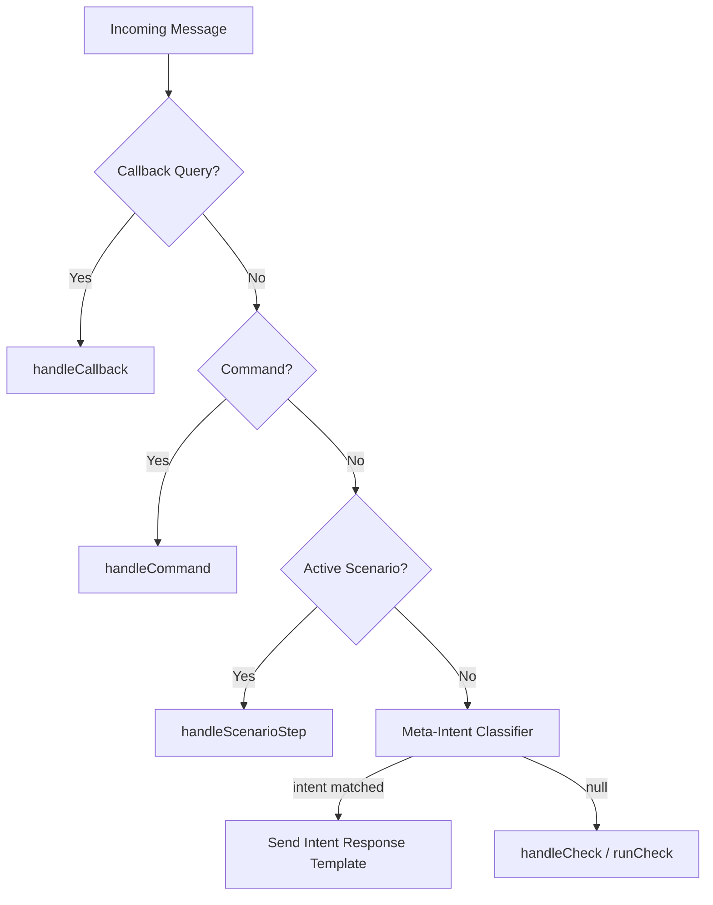

# Design Document: Meta Intent Router

## Overview

The Meta Intent Router adds a lightweight, deterministic classification step to the message-handling pipeline. Before text reaches the risk-scoring engine (`runCheck`), a pure synchronous TypeScript function inspects it for meta-questions — questions directed **at the bot itself** rather than content to be scam-checked.

The classifier uses keyword and regex pattern matching (no AI/LLM) across three languages (Russian, Uzbek Latin, English) and returns either a matched intent identifier or `null`. When an intent is matched, the bot responds with a pre-defined help template; when `null`, the text flows to the existing risk pipeline unchanged.

A strict "scam context signal override" guarantees that any text containing URLs, phone numbers, Telegram links, bank/payment terms, APK references, or exceeding 200 characters is **never** intercepted as a meta-question, preserving full security coverage.

## Architecture

The feature integrates into the existing dispatch flow as a new classification step between scenario-state checks and the risk pipeline:



**Key architectural decisions:**

1. **Single-module classifier** — `src/lib/meta-intent.ts` exports one pure function. No class hierarchy, no state, no dependencies beyond TypeScript built-ins.
2. **Signal-first rejection** — The classifier checks for scam context signals before attempting keyword matching. This is a fail-safe: if any signal is present, the function short-circuits to `null`.
3. **Router composition** — The existing `decideRoute` function in `router.ts` already returns `{ kind: "check", content }` for plain text. The meta-intent step is inserted in `dispatchUpdate` (or in the `handleCheck` entry point on both channels) before invoking `runCheck`, keeping the pure routing logic untouched.
4. **Shared across channels** — Both Telegram and web `/check` call the same `classifyMetaIntent` function, ensuring consistent behavior.

## Components and Interfaces

### Meta-Intent Classifier (`src/lib/meta-intent.ts`)

```typescript
/** Supported meta-intent categories */
export type MetaIntent =
  | "how_to_use"
  | "what_can_you_do"
  | "how_do_you_check"
  | "why_failed"
  | "explain_risk"
  | "telegram_account_limits"
  | "help";

/** Options passed alongside the raw text */
export interface ClassifyOptions {
  isForwarded?: boolean;
}

/**
 * Classify user text as a meta-question or null (proceed to risk pipeline).
 * Pure, synchronous, deterministic. No I/O, no AI.
 */
export function classifyMetaIntent(text: string, options?: ClassifyOptions): MetaIntent | null;
```

### Internal classification logic (private)

```typescript
/** Returns true if text contains any Scam_Context_Signal */
function hasScamContextSignal(text: string): boolean;

/** Returns true if text contains suspicious scam wording patterns */
function hasScamWordingPattern(text: string): boolean;

/** Attempts keyword/regex match against all MetaIntent categories */
function matchIntent(normalizedText: string): MetaIntent | null;
```

### Response templates (in `bot_dict` at `src/lib/telegram/bot-i18n.ts`)

Seven `meta_*` entries exist in `bot_dict`:

| Key                            | MetaIntent                |
| ------------------------------ | ------------------------- |
| `meta_how_to_use`              | `how_to_use`              |
| `meta_what_can_you_do`         | `what_can_you_do`         |
| `meta_how_do_you_check`        | `how_do_you_check`        |
| `meta_why_failed`              | `why_failed`              |
| `meta_explain_risk`            | `explain_risk`            |
| `meta_telegram_account_limits` | `telegram_account_limits` |
| `meta_help`                    | `help`                    |

Each entry provides `{ ru: string; uz: string; en: string }` following the existing `BotDict` pattern.

### Meta-Intent Response Handler

```typescript
/** Look up and return the response template for a matched intent */
export function getMetaIntentResponse(intent: MetaIntent, lang: Lang): string;
```

This is a thin lookup into `bot_dict` by the `meta_${intent}` key pattern.

### Router Integration

In `dispatchUpdate` (or alternatively in the Telegram `handleCheck` and web `checkInput` functions), the meta-intent classifier is invoked:

```typescript
// Before calling handleCheck / runCheck:
const intent = classifyMetaIntent(content, { isForwarded: !!message.forward_origin });
if (intent) {
  const response = getMetaIntentResponse(intent, session.lang);
  await sendMessage({ chatId, text: response });
  return;
}
// else: proceed to handleCheck / runCheck as before
```

### Web Channel Integration

In `src/lib/check.functions.ts`, the `checkInput` server function gains a meta-intent check:

```typescript
export const checkInput = createServerFn({ method: "POST" })
  .inputValidator(...)
  .handler(async ({ data }) => {
    const intent = classifyMetaIntent(data.input);
    if (intent) {
      return { metaIntent: intent, response: getMetaIntentResponse(intent, data.lang) };
    }
    return runCheck({ ... });
  });
```

The web response type is extended with an optional `metaIntent` discriminator so the frontend can render the help text differently from a risk result.

## Data Models

### MetaIntent type (enum of 7 string literals)

```typescript
type MetaIntent =
  | "how_to_use"
  | "what_can_you_do"
  | "how_do_you_check"
  | "why_failed"
  | "explain_risk"
  | "telegram_account_limits"
  | "help";
```

### Scam Context Signals (detection patterns)

| Signal                 | Detection Method                                                                     |
| ---------------------- | ------------------------------------------------------------------------------------ |
| Phone number           | Regex: digits with `+`, parens, dashes (7+ digits)                                   |
| URL                    | Regex: `https?://` or `www.` prefix                                                  |
| Telegram username/link | Regex: `@username`, `t.me/`, `telegram.me/`                                          |
| Bank/payment terms     | Keyword set: карта, CVV, PIN, OTP, SMS-код, перевод, karta, o'tkazma, transfer, etc. |
| APK reference          | Regex: `.apk` in text                                                                |
| Text length > 200      | `text.length > 200`                                                                  |
| Scam wording patterns  | Phrases: "безопасный счёт", "не кладите трубку", "xavfsiz hisob", etc.               |

### Intent keyword/pattern registry (internal)

Each `MetaIntent` maps to an array of patterns per language:

```typescript
interface IntentPattern {
  intent: MetaIntent;
  patterns: RegExp[]; // compiled, case-insensitive
}
```

Example patterns:

- `how_to_use`: `/как пользоваться/i`, `/qanday foydalanish/i`, `/how to use/i`, `/как работ/i`
- `what_can_you_do`: `/что .*ум[её]ешь/i`, `/nima qila olasan/i`, `/what can you do/i`
- `how_do_you_check`: `/как.*провер/i`, `/qanday tekshir/i`, `/how do you check/i`
- `why_failed`: `/почему не.*получил/i`, `/nima uchun.*ishlamadi/i`, `/why.*fail/i`
- `explain_risk`: `/что.*значит.*риск/i`, `/почему.*опасно/i`, `/xavf.*nima/i`, `/what.*risk.*mean/i`
- `telegram_account_limits`: `/scam.*метк/i`, `/возраст.*аккаунт/i`, `/account age/i`, `/scam label/i`, `/akkaunt.*yosh/i`
- `help`: `/^помо[гщ]/i`, `/^yordam/i`, `/^help$/i`, `/помоги/i`

### Classification algorithm (pseudocode)

```
classifyMetaIntent(text, { isForwarded }):
  1. If isForwarded → return null
  2. Trim and lowercase text
  3. If hasScamContextSignal(text) → return null
  4. If hasScamWordingPattern(text) → return null
  5. For each IntentPattern:
       If any pattern matches text → return intent
  6. Return null
```

## Correctness Properties

_A property is a characteristic or behavior that should hold true across all valid executions of a system — essentially, a formal statement about what the system should do. Properties serve as the bridge between human-readable specifications and machine-verifiable correctness guarantees._

### Property 1: Known meta-intent patterns are correctly classified

_For any_ known meta-intent keyword/phrase from the canonical pattern set, in any of the three supported languages (ru, uz, en), when no Scam_Context_Signal is present and `isForwarded` is false, the classifier SHALL return the correct corresponding MetaIntent identifier.

**Validates: Requirements 1.1, 1.2, 1.3, 2.5**

### Property 2: Scam context signals always override meta-intent detection

_For any_ text that contains at least one Scam_Context_Signal (URL, phone number, Telegram username/link, bank/payment term, APK reference, scam wording pattern, or exceeds 200 characters), the classifier SHALL return `null` regardless of whether meta-intent keywords are also present in the text.

**Validates: Requirements 2.1, 2.3**

### Property 3: Forwarded messages always bypass meta-intent detection

_For any_ text (including text that would otherwise match a meta-intent pattern), when `isForwarded` is `true`, the classifier SHALL return `null`.

**Validates: Requirements 2.2**

### Property 4: Non-matching text returns null

_For any_ arbitrary text that does not contain any known meta-intent keyword or pattern, the classifier SHALL return `null`.

**Validates: Requirements 1.4**

### Property 5: Classification-to-response round trip

_For any_ valid MetaIntent identifier and any supported Lang, classifying a canonical example for that intent and then looking up the corresponding Intent_Response_Template SHALL produce a non-empty string.

**Validates: Requirements 3.1, 6.5**

### Property 6: Response template length constraint

_For all_ Meta_Intent categories and all supported Lang variants, the Intent_Response_Template string SHALL be under 1000 characters.

**Validates: Requirements 6.6**

## Error Handling

The meta-intent classifier is a pure synchronous function with no failure modes — it always returns either a `MetaIntent` string or `null`. Error handling is minimal by design:

| Scenario                        | Behavior                                                                                                                                                        |
| ------------------------------- | --------------------------------------------------------------------------------------------------------------------------------------------------------------- |
| Empty or whitespace-only text   | `hasScamContextSignal` returns false (length ≤ 200), no keywords match → returns `null` → text proceeds to `handleCheck` which has its own empty-input handling |
| Null/undefined input            | TypeScript enforces `text: string`; if somehow bypassed, the function treats it as empty string                                                                 |
| Unknown language in text        | Pattern matching is language-agnostic (all patterns are checked); unrecognized language text simply won't match → returns `null` → proceeds to risk pipeline    |
| Regex catastrophic backtracking | Patterns are kept simple (no nested quantifiers); all regexes are pre-compiled at module load time with bounded inputs (text ≤ 200 chars after signal check)    |
| Template lookup fails           | `getMetaIntentResponse` falls back to the `help` template in `ru` if the key is missing — defensive coding against incomplete `bot_dict` entries                |

**Language fallback for response:** When the user's session `lang` is not available (new user, no session row), the handler falls back to `language_code` from the Telegram update's `from` field, then to `"ru"` as the final default.

## Testing Strategy

### Property-Based Tests (fast-check, vitest)

The classifier is an ideal candidate for PBT: it is a pure function with clear input/output, the input space is large (arbitrary strings × language × forwarded flag), and universal properties hold across all inputs.

**Library:** `fast-check` (already in devDependencies at version 4.8.0)
**Runner:** `vitest` (already configured)
**Minimum iterations:** 100 per property

Each property test is tagged with a comment referencing the design property:

```
// Feature: meta-intent-router, Property N: <property_text>
```

**Test file:** `src/lib/meta-intent.property.test.ts`

| Property                      | Generator Strategy                                                                                                        |
| ----------------------------- | ------------------------------------------------------------------------------------------------------------------------- |
| P1: Known patterns classified | `fc.constantFrom(...canonicalPatterns)` × `fc.constantFrom("ru","uz","en")` — canonical phrase with random padding/casing |
| P2: Scam signals override     | `fc.oneof(urlArb, phoneArb, tgLinkArb, bankTermArb, longTextArb)` combined with `fc.constantFrom(...metaKeywords)`        |
| P3: Forwarded bypass          | `fc.string()` with `isForwarded: true`                                                                                    |
| P4: Non-matching returns null | `fc.string()` filtered to exclude all known meta-intent keywords                                                          |
| P5: Round-trip                | `fc.constantFrom(...ALL_INTENTS)` × `fc.constantFrom("ru","uz","en")`                                                     |
| P6: Template length           | `fc.constantFrom(...ALL_INTENTS)` × `fc.constantFrom("ru","uz","en")`                                                     |

### Unit Tests (example-based)

**Test file:** `src/lib/meta-intent.test.ts`

Covers the 9 specific scenarios from Requirement 6.7:

1. "помогите, мне прислали ссылку https://example.com" → routes to check (null)
2. "почему это опасно?" → routes to `explain_risk` (no scam artifact)
3. "как проверить номер?" → routes to `how_do_you_check`
4. Forwarded long scam text → routes to check (null)
5. URL combined with help wording → routes to check (null)
6. RU/UZ/EN examples for each of the 7 intents
7. Commands (/help, /start) are not intercepted (tested at router level)
8. Text during active report flow is not intercepted (tested at router level)
9. Telegram account visibility questions (scam-label, account age, reports, spam history) return `telegram_account_limits` unless a concrete username/link is present

### Integration Tests

**Test file:** `src/lib/telegram/handlers/meta-intent.integration.test.ts`

- Router priority: commands, callbacks, scenarios all bypass meta-intent
- Router invokes classifier before `handleCheck` for plain text
- Web handler returns template text instead of risk result when intent matched
- `forward_origin` flag is correctly passed to classifier
