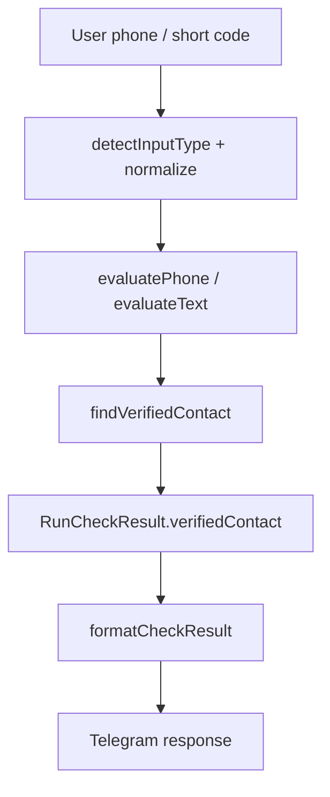

# Design: Phone Directory v1

## Overview

Phone Directory v1 is a small safety layer over the existing `VERIFIED_CONTACTS` module and `runCheck` phone pipeline. It does not try to identify arbitrary numbers. Instead it improves two outcomes:

1. Exact official match: show a clearer localized verified-contact response, source confidence and spoofing warning.
2. Unknown phone: explain that the number alone is inconclusive and ask for the caller's request/context.

## Architecture

The existing `runCheck` pipeline remains the authority for input detection, normalization, hashing, rate limiting and risk scoring.



## Components And Interfaces

### `verified-contacts.ts`

The existing trusted directory remains the only source of official labels. Entries require authoritative sources and `verifiedAt`.

### `check-core.ts`

`RunCheckResult.verifiedContact` is enriched with non-sensitive display metadata:

```ts
{
  orgName: string;
  orgType: string;
  source: string;
  display: string;
  contactType: string;
  verificationLevel: "high" | "medium";
  description: string;
}
```

The organization and description are localized using `params.lang`.

### `format.ts`

The formatter renders:

- official match badge;
- spoofing warning;
- verified display value and source confidence;
- compact unknown-phone brief and next-step prompt when no match exists.

## Correctness Properties

1. Unknown phone numbers never produce organization names.
2. Official names are localized to the selected language.
3. Dangerous reason codes prevent an official match from lowering risk to `safe`.
4. The full raw submitted phone number is not rendered for unknown phone checks.
5. No raw phone value is stored in `LastCheckSnapshot`.

## Error Handling

Directory lookup is pure and best-effort. If a match is absent, the pipeline falls back to neutral unknown-phone guidance. If formatting metadata is missing, the bot still shows the current verified warning.

## Testing Strategy

- Unit tests for `runCheck` verified-contact localization.
- Formatter tests for verified and unknown phone responses.
- Regression tests for dangerous official-looking messages.
- Existing privacy and redaction property tests remain in force.
