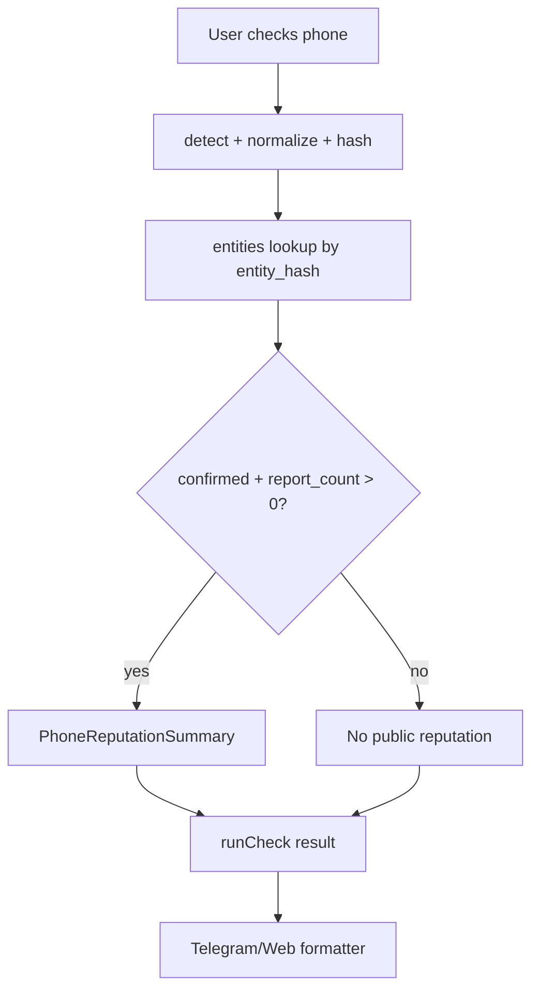

# Design: Phone Reputation v1

## Overview

The existing `entities` table already aggregates reports by HMAC hash and only exposes confirmed rows publicly. Phone Reputation v1 reuses that boundary and adds a small typed presentation layer for phone checks.

## Architecture



## Components And Interfaces

### `src/lib/risk/phone-reputation.ts`

Pure module that converts an entity row into a public summary:

```ts
interface PhoneReputationSummary {
  source: "ishonch_guard_moderated_reports";
  confirmedReportCount: number;
  confidence: "low" | "medium" | "high";
  riskLevel: RiskLevel;
  publicScope: "confirmed_moderated_reports_only";
}
```

Confidence thresholds are intentionally conservative:

- 1 confirmed report -> low
- 2-4 confirmed reports -> medium
- 5+ confirmed reports -> high

### `src/lib/risk/check-core.ts`

`runCheck` builds `phoneReputation` only when the detected input is `phone` and the entity row is confirmed. Existing `knownReports` and `known_reported` behavior remains.

### `src/lib/telegram/format.ts`

The "what noticed" section renders a phone-specific line:

- source: Ishonch Guard moderated reports;
- confirmed report count;
- confidence label;
- explicit limitation: this does not identify the owner and is not carrier data.

## Data Models

No schema migration is required for v1. It uses:

- `entities.entity_type = phone`
- `entities.entity_hash`
- `entities.report_count`
- `entities.risk_level`
- `entities.moderation_status`

## Correctness Properties

1. Unconfirmed reports never affect public phone reputation wording.
2. Confirmed phone entities with positive counts produce a summary.
3. The formatter never claims owner, account age, hidden labels, carrier data, or spam history.
4. High-risk confirmed phone entities still use `known_reported`.
5. The raw submitted phone number is not rendered.

## Error Handling

If entity lookup fails or the row is malformed, reputation enrichment returns `null` and the existing phone passport/unknown-phone guidance is shown.

## Testing Strategy

- Unit tests for reputation summary construction and confidence thresholds.
- `runCheck` regression test for confirmed high-risk phone entity.
- Telegram formatter test for source, confidence, limitation wording and raw-number privacy.
