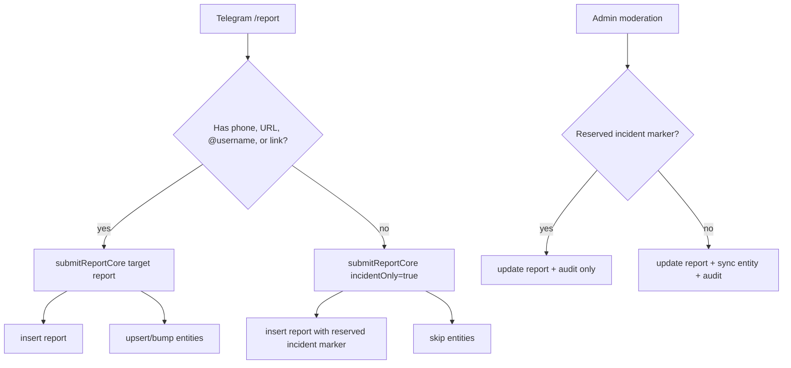

# Design

## Overview

Report Flow Reputation Boundary v1 adds a schema-compatible incident-only
marker for `/report` submissions that have a description but no concrete target.
The marker allows the existing `reports` schema to keep storing incidents while
the `entities` reputation table remains target-only.

## Architecture

## Components and Interfaces

- `src/lib/report-boundary.ts`
  - `INCIDENT_ONLY_REDACTED_VALUE`
  - `INCIDENT_ONLY_HASH_PREFIX`
  - `isIncidentOnlyReportProjection(report)`
- `src/lib/report.functions.ts`
  - Adds `incidentOnly?: boolean` to the validated submit payload.
  - Uses the reserved marker for incident-only `redacted_value`.
  - Skips entity upsert when `incidentOnly=true`.
- `src/lib/telegram/handlers/report.ts`
  - Sends `incidentOnly=true` for no-target reports.
  - Does not use the free-form description as the report target.
- `src/lib/admin.functions.ts`
  - Extracts `moderateReportCore` for testability.
  - Skips entity sync for the incident-only marker.

## Data Model

No Supabase migration is required for v1. The existing `reports` table has
required entity fields, so incident-only reports use:

- `entity_type = "text"`
- `redacted_value = "__ishonch_guard_incident_only__"`
- `entity_hash = hash("incident-only:" + redactedDescription)`

The reserved marker is never shown as public reputation and is used only to keep
admin moderation and submit behavior consistent.

## Correctness Properties

1. Incident-only reports are stored in `reports`.
2. Incident-only reports never insert into `entities` during submit.
3. Incident-only reports never update `entities` during submit.
4. Incident-only moderation updates report status and audit log.
5. Incident-only moderation never inserts or updates `entities`.
6. Target reports preserve existing entity upsert and moderation behavior.

## Error Handling

Submit failures keep existing retry behavior. The incident marker is created
after deterministic redaction, so raw user descriptions are not used as public
display strings. Audit-log insertion remains best-effort and does not block the
moderation result.

## Testing Strategy

- `report.functions.test.ts`: submit-time incident-only and target-report
  regression tests.
- `report.scenario.test.ts`: Telegram no-target flow payload regression.
- `admin.functions.test.ts`: moderation boundary tests for incident-only and
  target reports.
