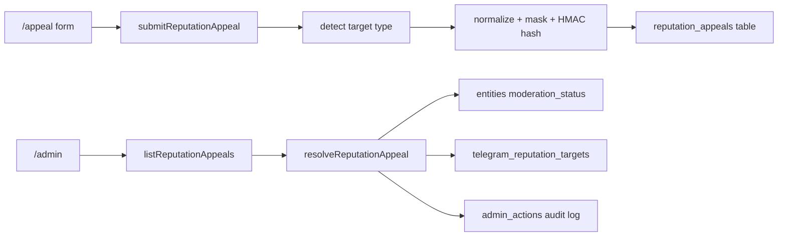

# Design — Reputation Appeals v1

## Overview

The feature adds a privacy-safe correction path for public reputation. It does not create a public lookup service, and it does not delete report history. It gives admins an audited way to remove public labels when a reputation record is wrong, stale or unsupported.

## Architecture

## Data Model

`public.reputation_appeals`

- `target_type`: `input_type`
- `target_hash`: HMAC hash of normalized target
- `target_display`: masked target for admin triage
- `reason`: redacted explanation
- `contact_hash`: optional HMAC hash of contact
- `contact_display`: optional masked contact
- `status`: `new | reviewing | resolved | rejected`
- `resolution`: admin decision note

## Security

- RLS is enabled.
- `anon` and `authenticated` have no direct grants.
- Server functions use `service_role`.
- Appeal decisions are written into `admin_actions`.
- Reports are not deleted by appeal decisions.

## Testing Strategy

- Unit tests for privacy redaction and target-type rejection.
- Unit tests for removing reputation via admin core.
- Typecheck and production build verify route and server function integration.
