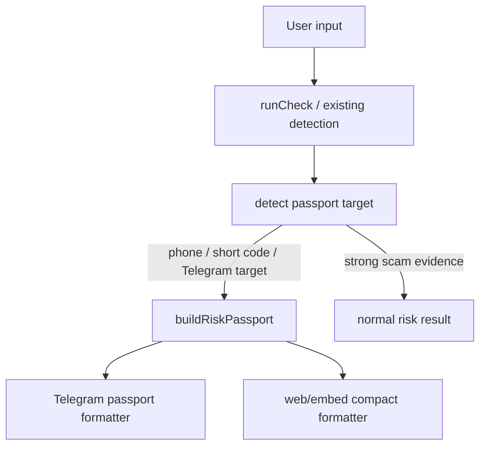

# Design

## Overview

Risk Passport v1 is a presentation and routing layer on top of the existing
rules-first check pipeline. It does not add new hidden data sources. It turns
low-evidence phone and Telegram checks into a structured, honest passport with
visible facts, unavailable facts, moderated Ishonch Guard reputation and next
evidence guidance.

## Architecture

The passport builder runs after `runCheck` has produced deterministic signals
and after any existing public metadata/reputation lookups have completed.



Strong scam evidence still wins. A message asking for OTP, card data, APK,
payment or safe-account transfer should remain a risk result, not be softened
into a passport.

## Components and Interfaces

### `RiskPassport`

```ts
export type RiskPassportTargetType = "telegram" | "phone" | "short_code";

export interface RiskPassport {
  targetType: RiskPassportTargetType;
  displayValue: string;
  confidence: "low" | "medium" | "high";
  visibleFacts: string[];
  unavailableFacts: string[];
  reputationFacts: string[];
  officialFacts: string[];
  nextEvidencePrompt: string;
  contextButtons: RiskPassportButton[];
}

export interface RiskPassportButton {
  id: "code" | "card" | "transfer" | "apk" | "link_qr" | "live_call" | "new_check";
  labelKey: string;
}
```

### Builder Inputs

The builder should reuse existing data already produced by the bot:

- normalized target and input type from the check pipeline;
- Telegram public metadata when `getChat` returned it;
- phone parsing and official-directory lookups;
- moderated Ishonch Guard report counts;
- existing reason codes and risk level.

It must not call MTProto, scrape Telegram, infer account age or enrich with
contact-name databases.

## Data Models

No new database tables are required for v1. Use existing moderated reputation
records and existing verified contacts. If future paid phone enrichment is
added, it must remain an additive evidence source with provider/source labels.

## Error Handling

- If reputation lookup fails, render the passport without reputation facts and
  say the local report check is temporarily unavailable.
- If phone parsing fails, render a generic phone passport with the raw value
  redacted/normalized according to existing rules.
- If Telegram metadata lookup fails, render the honest Bot API limitation text.
- Never downgrade a high-risk result into a passport because metadata failed.

## Testing Strategy

- Unit tests for `buildRiskPassport` target selection and evidence boundaries.
- Snapshot tests for RU/UZ/EN Telegram passport formatting.
- Regression tests that known scam evidence still renders high-risk results.
- Tests that hidden Telegram facts are never claimed.
- Tests that "new check" wording is explicit and context buttons do not rerun
  the same inconclusive result.
