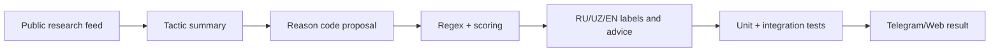

# Design: Scam Research Feed v1

## Overview

This feature adds a narrow, test-backed research pipeline for new scam patterns. Public feeds such as pressauz are treated as signals for recurring tactics. The product receives generalized reason codes and advice, not copied news text.

## Architecture



## Components

- `src/lib/risk/rules.ts`
  - Add `telegram_account_takeover_phishing` and `dropper_recruitment`.
  - Keep score thresholds unchanged.
  - Require explicit action language to reduce false positives.
- `src/lib/telegram/advice-filter.ts`
  - Add context-specific advice categories for account takeover and dropper recruitment.
- `src/lib/risk/rules.reason-codes.test.ts`
  - Add positive/negative examples and scoring assertions.
- `ai_docs/SCAM_COVERAGE.md`
  - Record the two tactics and source handling rule.

## Data Models

```ts
type NewReasonCode =
  | "telegram_account_takeover_phishing"
  | "dropper_recruitment";
```

No database schema change is required.

## Correctness Properties

1. General Telegram account-deletion questions without a link/action SHALL NOT trigger the takeover code.
2. Account-deletion/cancel messages with link/code/action language SHALL trigger takeover detection.
3. Dropper recruitment SHALL require both an asset/access target and transfer/rent/sell/reward language.
4. The new rules SHALL NOT alter score thresholds for existing reason codes.
5. New advice SHALL be specific and SHALL NOT instruct generic unrelated actions as the first step.

## Error Handling

If a pattern is ambiguous, the engine should prefer `unknown`/`suspicious` over `high_risk`. AI explanation remains optional; deterministic scoring must work without `OPENAI_API_KEY`.

## Testing Strategy

- Unit tests for `evaluateText`.
- Scoring tests for `scoreFromCodes`.
- Telegram format tests for advice relevance and MarkdownV2 validity.
- Full regression run before merge.
