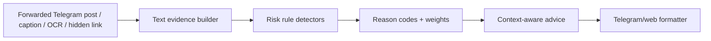

# Design: Scam Research Feed v2

## Overview

Scam Research Feed v2 adds deterministic Web3/Telegram promo-pattern detection to the existing risk rules. It is intentionally rules-first and moderate-weight: the bot should say "be careful" for risky promo mechanics, and only escalate when multiple signals combine.

## Architecture

## Components

- `src/lib/risk/rules.ts`
  - Add reason codes:
    - `crypto_casino_bonus_funnel`
    - `fake_captcha_or_voting`
    - `task_reward_engagement_bait`
    - `wallet_action_urgency`
    - `ton_referral_earning_scheme`
  - Add conservative two-part detectors: context + action.
- `src/lib/telegram/advice-filter.ts`
  - Add wallet-specific advice.
  - Reuse gambling/giveaway advice for casino, CAPTCHA, task and referral bait.
- `src/lib/telegram/public-metadata.server.ts`
  - Show compact labels for the new Telegram-facing signals.
- Tests
  - Add positive/negative examples to `rules.reason-codes.test.ts`.
  - Update property fixtures and formatter reason-code universe.

## Scoring

The new rules do not change thresholds.

| Code                          | Weight | Rationale                                               |
| ----------------------------- | -----: | ------------------------------------------------------- |
| `crypto_casino_bonus_funnel`  |     25 | Suspicious alone; high with invite/weird link.          |
| `fake_captcha_or_voting`      |     30 | Strong engagement gate; high with giveaway/wallet/code. |
| `task_reward_engagement_bait` |     20 | Suspicious alone; high with deposit/link/withdraw.      |
| `wallet_action_urgency`       |     30 | Strong, but legitimate wallet news exists.              |
| `ton_referral_earning_scheme` |     20 | Suspicious incentive pattern; not always fraud alone.   |

## Correctness Properties

1. New codes never make `verified_official` unsafe because the existing safe override remains.
2. Single topic terms (`TON`, `NFT`, `wallet`, `casino`) do not trigger without action/benefit language.
3. Private invite links combine with these codes to raise risk naturally through existing scoring.
4. Advice remains max 3 bullets and context-specific.

## Error Handling

If input is ambiguous, the result should be `unknown` or `suspicious`, not `high_risk`. AI can enrich explanations, but deterministic scoring must work without AI.

## Testing Strategy

- Unit tests for `evaluateText` positives/negatives.
- Integration scoring tests for combinations with invite/short/weird links.
- Advice filter tests for new categories.
- Formatter/property fixture updates.
- Full `test:run`, `tsc`, `lint`, `build`, production smoke after deploy.
