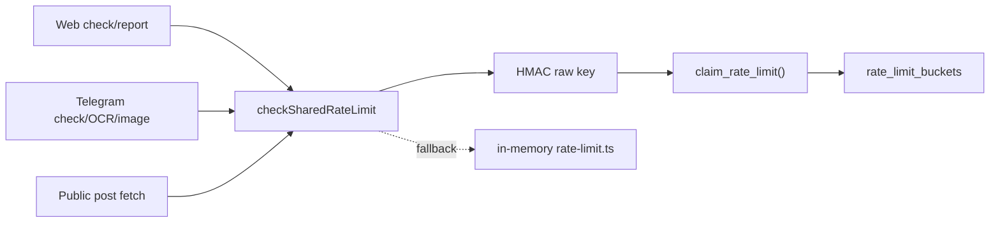

# Design Document

## Overview

Shared Rate Limits v1 adds a small privacy-safe Supabase bucket layer in front
of the existing in-memory limiter. Production calls use the shared layer first;
local/test/misconfigured environments transparently fall back to the previous
process-local limiter.

## Architecture



## Components and Interfaces

- `public.rate_limit_buckets`: short-lived service-role-only bucket table.
- `public.claim_rate_limit(scope, key_hash, limit, window_seconds)`: atomic
  Postgres function executable only by `service_role`.
- `src/lib/risk/shared-rate-limit.server.ts`: server helper that hashes raw keys,
  calls the RPC, validates response shape and falls back locally.
- Existing callers:
  - `runCheck`
  - `ocrExtractCore`
  - `analyzeImageCore`
  - `submitReportCore`
  - `buildTelegramPublicPostCheckEvidence`

## Data Models

```ts
type SharedRateLimitScope = "check" | "report" | "telegram_public_post";

type RateLimitResult = {
  ok: boolean;
  remaining: number;
  retryAfterSec: number;
};
```

Database fields:

- `scope`: fixed enum-like text.
- `key_hash`: 64-char lowercase hex HMAC.
- `bucket_start`: fixed window start.
- `window_seconds`: request window size.
- `count`: observed request count in the bucket.
- `expires_at`: cleanup boundary.

## Correctness Properties

1. Raw rate-limit keys are never present in RPC arguments except before hashing.
2. Missing Supabase/pepper env never crashes local tests; it uses local fallback.
3. Shared RPC `allowed=false` maps to `ok=false` and preserves retry seconds.
4. RPC errors use local fallback instead of dropping user requests.
5. Public-post fetch uses a separate scope from normal check scoring.
6. Report submission performs throttling before DB insert/upsert work.

## Error Handling

- Invalid helper arguments return a blocked result with a conservative retry.
- RPC errors and invalid response shapes are sanitized in logs and fall back.
- Missing `HASH_PEPPER_SECRET` in production should be caught by smoke/ops; the
  helper still avoids weak hashing by not persisting anything without pepper.

## Testing Strategy

- Unit tests for shared helper env fallback, privacy of RPC payloads, blocked
  mapping and RPC failure fallback.
- Existing report/public-post tests prove behavior remains stable.
- Production security smoke verifies anon cannot read `rate_limit_buckets` or
  execute `claim_rate_limit`, while service-role can count and claim.
- Migration verification checks table RLS/grants and RPC execution in Supabase.
