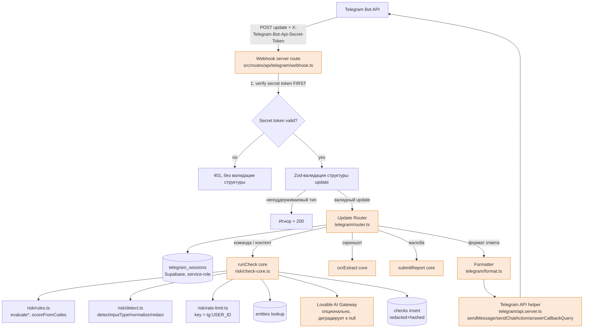
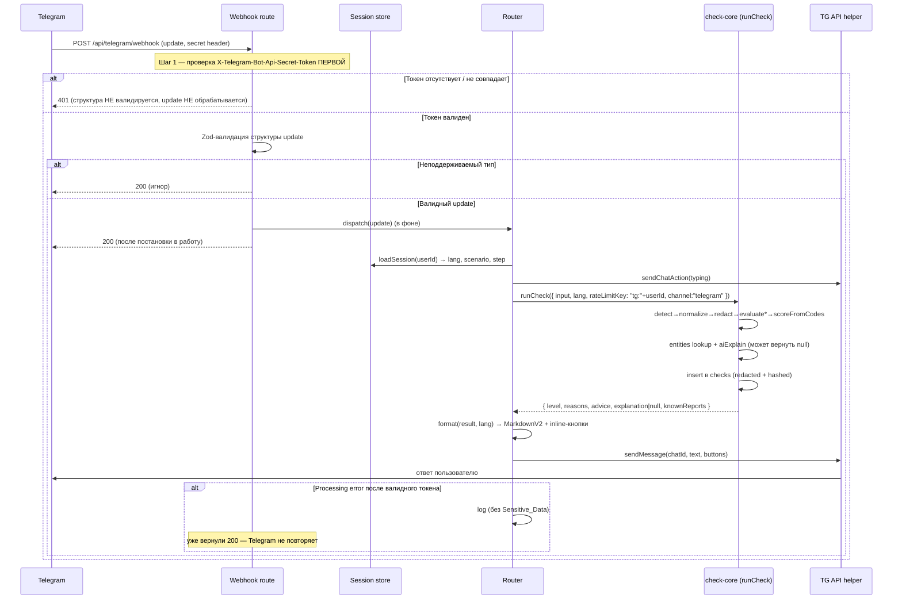
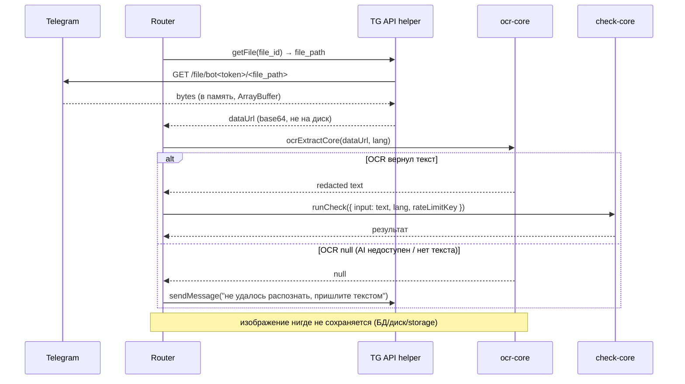
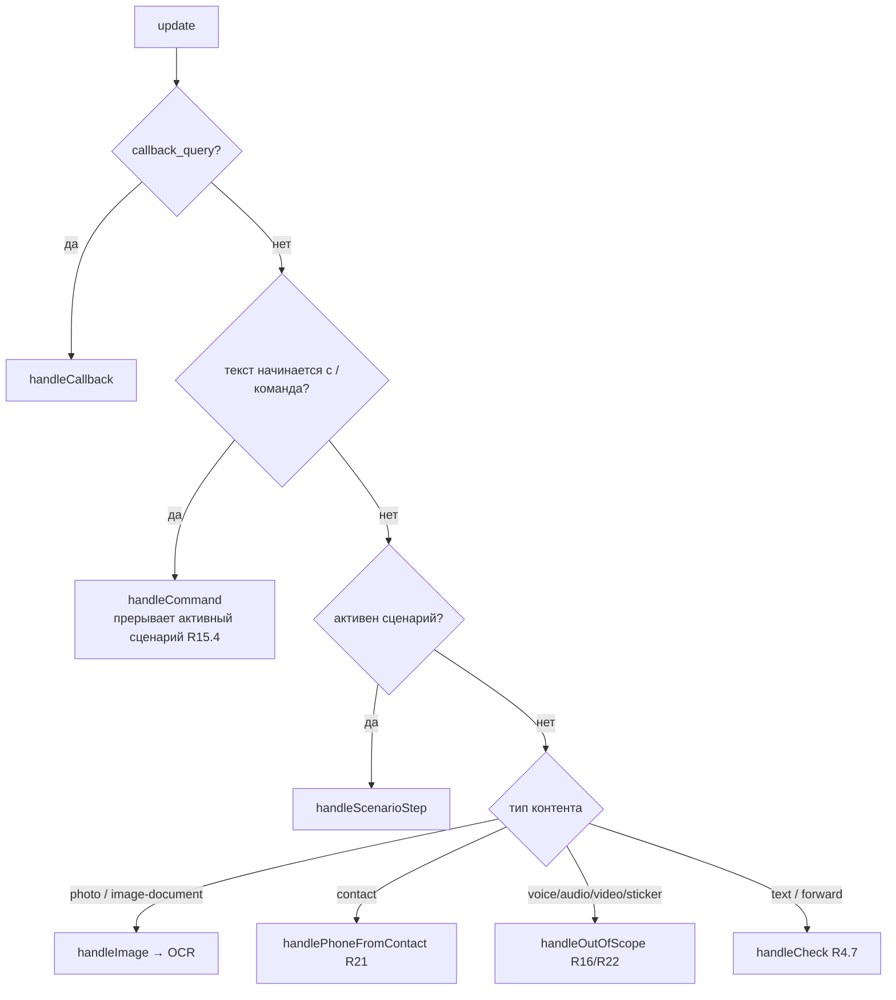

# Design Document: Telegram Bot MVP (Ishonch Guard)

## Overview

_(Обзор)_

Telegram-бот добавляется к существующему веб-приложению Ishonch Guard как **новый канал**, не меняя архитектурный принцип «scoring правилами, AI только объясняет». Бот принимает обновления Telegram через HTTPS-webhook (TanStack Start server route на рантайме Nitro / Cloudflare Workers), маршрутизирует их (команда / шаг сценария / свободный контент / callback / фото / контакт), переиспользует risk engine (`src/lib/risk/*`) и серверные конвейеры (`checkInput`, `ocrExtract`, `submitReport`) через **вынесенное общее ядро** и отвечает пользователю на одном из трёх языков (RU / UZ / EN) с уровнем риска, объяснением, reason-кодами, советами (ADVICE) и inline-кнопками.

Ключевая архитектурная задача — **не дублировать** логику scoring/redaction/AI/lookup. Сейчас вся проверка живёт внутри `createServerFn`-обёртки `checkInput`, которая жёстко привязана к HTTP-контексту веба (rate-limit по IP через `getRequestHeader`/`getRequestIP`). Чтобы бот мог переиспользовать ту же логику с rate-limit по `telegram_user_id`, мы выносим транспортно-независимое ядро в `src/lib/risk/check-core.ts`. Существующий `checkInput` становится тонкой обёрткой над ядром (извлекает IP → строит `rateLimitKey` → вызывает ядро), а бот вызывает то же ядро с ключом на основе `telegram_user_id`.

Состояние диалога (`Session_State`) и выбранный язык **не** хранятся in-memory: на edge/Cloudflare воркеры не шарят память и не переживают рестарт. Вводится таблица Supabase `telegram_sessions`, доступная только service-role, как единый источник правды для языка и текущего шага сценария.

Бот строго соблюдает приватность: чувствительные данные редактируются (`redactText`) и хешируются (`hashIdentifier`) до любой записи в БД, изображения обрабатываются только в памяти и не сохраняются, никого не называют мошенником поимённо — только Risk_Level + reason codes.

## Трассируемость: разделы дизайна → требования

| Раздел дизайна | Покрывает требования |
|---|---|
| Общее ядро проверки `check-core.ts` | R4, R7, R10, R13, R14, R18 |
| Webhook server route + аутентификация токеном | R12, R17 |
| Telegram Bot API helper (server-only) | R1, R4, R5, R6, R17, R18, R19 |
| `telegram_sessions` + Session store | R1, R2, R6, R15 |
| Роутер обновлений | R1–R6, R11, R15, R16, R21, R22 |
| Новые reason codes (rules.ts) | R14 |
| Форматтер результата (мультиязык, MarkdownV2) | R2, R4, R5, R8, R13, R20 |
| OCR-поток без сохранения изображений | R5, R16 |
| Поток жалобы (`/report`) | R6, R9 |
| Режим паники `/emergency` | R20 |
| Контакт-карта | R21 |
| Границы MVP | R11, R16, R22 |
| Деградация AI | R13, R18 |
| Обработка ошибок | R10, R12, R13, R16 |
| Наблюдаемость / логирование | R17, R19 |

## Architecture

_(Архитектура)_

### Компонентная диаграмма



### Sequence: поток webhook → auth → parse → router → pipeline → format → send



### Sequence: проверка скриншота (OCR без сохранения)



## Components and Interfaces

_(Компоненты и интерфейсы)_

> Ниже приведены только сигнатуры, типы и контракты. Полная реализация — на этапе задач. Все модули с суффиксом `.server.ts` и любой код, читающий секреты, **никогда** не импортируется в клиент (CODING_RULES §2). Секреты читаются **внутри** хендлеров (per-request на Cloudflare), не на уровне модуля (CODING_RULES §6).

### 1. Общее ядро проверки — `src/lib/risk/check-core.ts`

Транспортно-независимое ядро, в которое переезжает вся текущая логика тела `checkInput.handler`. Не знает ни про HTTP, ни про Telegram — принимает уже вычисленный `rateLimitKey`.

```typescript
import type { Lang } from "@/lib/i18n";
import type { InputType } from "./detect";
import type { ReasonCode, RiskLevel } from "./rules";

/** Источник запроса — для аналитики/логов; не влияет на scoring. */
export type CheckChannel = "web" | "telegram";

export interface RunCheckParams {
  input: string;                 // сырой ввод пользователя (до redaction)
  type?: InputType;              // опционально; иначе detectInputType
  lang: Lang;
  rateLimitKey: string;          // "check:<ip>" для веба, "tg:<userId>" для бота
  channel?: CheckChannel;        // default "web"
  skipAi?: boolean;              // принудительно без AI (например быстрый путь)
}

export interface RunCheckResult {
  type: InputType;
  display: string;               // maskForDisplay — безопасно для показа
  level: RiskLevel;
  score: number;
  reasons: ReasonCode[];
  explanation: string | null;    // null при недоступном AI (деградация, R13)
  knownReports: number;          // >0 только для Confirmed_Entity
}

export type RateLimitedError = Error & { status: 429; retryAfter: number };

/**
 * Единый конвейер проверки (rules-first):
 *   rate-limit(rateLimitKey) → detectInputType → normalize →
 *   maskForDisplay + redactText → evaluate* → entities lookup →
 *   scoreFromCodes → aiExplain(optional) → insert into checks.
 *
 * Контракт:
 *  - score/level вычисляются ТОЛЬКО scoreFromCodes (детерминированно, R13.5).
 *  - В checks пишутся только redacted + hashed данные (R7).
 *  - При превышении лимита бросает RateLimitedError (status 429, retryAfter).
 *  - explanation === null при отсутствии LOVABLE_API_KEY или ошибке AI (R13).
 */
export async function runCheck(params: RunCheckParams): Promise<RunCheckResult>;

/** OCR-ядро: извлечение+редактирование текста из data URL изображения. */
export async function ocrExtractCore(
  dataUrl: string,
  lang: Lang,
  rateLimitKey: string,
): Promise<{ text: string | null }>;
```

**Рефакторинг существующего кода.** `aiExplain` и `ocrScreenshot` (сейчас приватные в `check.functions.ts`) переезжают в `check-core.ts` (или в соседний `ai.server.ts`, импортируемый ядром). После рефакторинга `checkInput` становится тонкой обёрткой:

```typescript
// src/lib/check.functions.ts (после рефакторинга — поведение неизменно)
export const checkInput = createServerFn({ method: "POST" })
  .inputValidator((d: unknown) => checkSchema.parse(d))
  .handler(async ({ data }) => {
    const ip =
      getRequestHeader("cf-connecting-ip") ||
      getRequestHeader("x-real-ip") ||
      getRequestIP({ xForwardedFor: true }) ||
      "unknown";
    return runCheck({
      input: data.input, type: data.type, lang: data.lang,
      rateLimitKey: `check:${ip}`, channel: "web",
    });
  });
```

`ocrExtract` аналогично делегирует в `ocrExtractCore`. Это сохраняет существующий веб-контракт (ключ `check:<ip>`, лимит 10/мин) без изменения scoring.

### 2. Telegram Bot API helper — `src/lib/telegram/api.server.ts`

Тонкая обёртка над Telegram Bot API. Токен читается **внутри функций** из `process.env.TELEGRAM_BOT_TOKEN`. Никаких библиотек-фреймворков (см. Open Decision 1 — выбор «ручной helper»).

```typescript
export interface InlineButton { text: string; callback_data: string }
export type InlineKeyboard = InlineButton[][];

export interface SendMessageOptions {
  chatId: number;
  text: string;                  // уже экранированный MarkdownV2
  keyboard?: InlineKeyboard;
  parseMode?: "MarkdownV2" | "HTML" | "None";
  disablePreview?: boolean;
}

/** Отправка сообщения. Текст ДОЛЖЕН быть пропущен через escapeMarkdownV2. */
export function sendMessage(opts: SendMessageOptions): Promise<{ ok: boolean }>;

/** Индикатор "печатает…" пока идёт долгая обработка (R18.2). */
export function sendChatAction(chatId: number, action: "typing"): Promise<void>;

/** Подтверждение нажатия inline-кнопки (убирает "часики"). */
export function answerCallbackQuery(callbackQueryId: string, text?: string): Promise<void>;

/** Метаданные файла (для скриншотов). */
export function getFile(fileId: string): Promise<{ filePath: string; fileSize: number } | null>;

/**
 * Скачивание файла В ПАМЯТЬ (ArrayBuffer → data URL). Никогда не пишет на диск.
 * Проверяет лимит размера (6 МБ для OCR_Pipeline, R5.5) до скачивания.
 */
export function downloadFileAsDataUrl(filePath: string): Promise<string | null>;

/** Одноразовая настройка webhook (вызывается админ-скриптом, не в рантайме). */
export function setWebhook(url: string, secretToken: string): Promise<{ ok: boolean }>;

/** Экранирование спецсимволов MarkdownV2: _ * [ ] ( ) ~ ` > # + - = | { } . ! */
export function escapeMarkdownV2(s: string): string;
```

### 3. Session store — `src/lib/telegram/session.server.ts`

Источник правды для языка и шага сценария. Работает поверх `telegram_sessions` через `supabaseAdmin`.

```typescript
import type { Lang } from "@/lib/i18n";

export type Scenario =
  | "none"            // нейтральное состояние
  | "await_check"     // после /check ждём контент
  | "report_value"    // ждём значение жалобы
  | "report_desc"     // ждём описание
  | "report_scamType" // опционально
  | "report_city"     // опционально
  | "report_amount";  // опционально

export interface ReportDraft {
  value?: string;
  description?: string;
  scamType?: string;
  city?: string;
  amountLostUzs?: number;
}

export interface Session {
  telegramUserId: number;
  lang: Lang;                 // default "ru" если не задан (R1.4)
  scenario: Scenario;
  scenarioStep: number;
  scenarioData: ReportDraft;  // jsonb
  updatedAt: string;
}

/** Загрузка сессии; при отсутствии — дефолт { lang:"ru", scenario:"none" } (R1.4). */
export function loadSession(telegramUserId: number): Promise<Session>;

/** Частичное сохранение (upsert по telegram_user_id). Возвращает ok-флаг (R2.3). */
export function saveSession(
  telegramUserId: number,
  patch: Partial<Omit<Session, "telegramUserId">>,
): Promise<{ ok: boolean }>;

/** Смена языка с подтверждением ok/!ok для обработки сбоя (R2.2, R2.3). */
export function setLanguage(telegramUserId: number, lang: Lang): Promise<{ ok: boolean }>;

/** Сброс сценария в нейтральное состояние по завершении (R15.5). */
export function resetScenario(telegramUserId: number): Promise<void>;
```

### 4. Webhook server route — `src/routes/api/telegram/webhook.ts`

HTTP-эндпоинт для Telegram. Размещается внутри текущего приложения как server route (Open Decision 2 — отдельный маршрут в текущем приложении на Nitro/Cloudflare). В TanStack Start v1 server route объявляется через серверный обработчик метода `POST` (точная форма API — `createServerFileRoute(...).methods({ POST })` или route-`server.handlers`, фиксируется на этапе задач; контракт ниже не зависит от формы).

```typescript
// Псевдо-контракт обработчика (порядок шагов фиксирован Requirement 12).
async function handleTelegramWebhook(request: Request): Promise<Response> {
  // R12.1 / R12.2 — токен ПЕРВЫМ, до любой валидации структуры.
  const secret = process.env.TELEGRAM_WEBHOOK_SECRET;       // читаем в хендлере
  const botToken = process.env.TELEGRAM_BOT_TOKEN;
  if (!secret || !botToken) {
    // R17.4 — конфиг отсутствует: не обрабатывать, залогировать без значений.
    console.error("telegram webhook misconfigured: missing secrets");
    return new Response("unauthorized", { status: 401 });   // R12.6 — token-этап = 401
  }
  const header = request.headers.get("X-Telegram-Bot-Api-Secret-Token");
  if (header !== secret) {
    return new Response("unauthorized", { status: 401 });   // R12.2 — без валидации структуры
  }

  // R12.3 — структура валидируется ТОЛЬКО после успешного токена.
  let update: TelegramUpdate;
  try {
    update = telegramUpdateSchema.parse(await request.json()); // zod (CODING_RULES)
  } catch {
    return new Response("ok", { status: 200 });             // невалидная структура — 200, игнор
  }

  try {
    await dispatchUpdate(update);                           // R12.4 — постановка в работу
  } catch (err) {
    // R12.5 — processing error ПОСЛЕ валидного токена → 200, чтобы Telegram не ретраил.
    logError("dispatch failed", err);                       // R19 — без Sensitive_Data
  }
  return new Response("ok", { status: 200 });
}
```

**Zod-схема update** (только нужные MVP-поля; неподдерживаемые игнорируются, R12.3):

```typescript
const telegramUpdateSchema = z.object({
  update_id: z.number(),
  message: z.object({
    message_id: z.number(),
    from: z.object({ id: z.number(), language_code: z.string().optional() }),
    chat: z.object({ id: z.number() }),
    text: z.string().optional(),
    caption: z.string().optional(),
    entities: z.array(z.object({ type: z.string(), offset: z.number(), length: z.number() })).optional(),
    photo: z.array(z.object({ file_id: z.string(), file_size: z.number().optional() })).optional(),
    document: z.object({ file_id: z.string(), mime_type: z.string().optional(), file_size: z.number().optional() }).optional(),
    contact: z.object({ phone_number: z.string(), first_name: z.string().optional() }).optional(),
    voice: z.unknown().optional(),     // вне объёма (R22) — распознаётся, чтобы вежливо отклонить
    audio: z.unknown().optional(),
    video: z.unknown().optional(),
    sticker: z.unknown().optional(),
    forward_origin: z.unknown().optional(), // forward → текст как обычный ввод (R11.5)
  }).optional(),
  callback_query: z.object({
    id: z.string(),
    from: z.object({ id: z.number() }),
    message: z.object({ chat: z.object({ id: z.number() }) }).optional(),
    data: z.string(),
  }).optional(),
}).passthrough();

export type TelegramUpdate = z.infer<typeof telegramUpdateSchema>;
```

### 5. Роутер обновлений — `src/lib/telegram/router.ts`

Определяет тип обновления и направляет в нужный обработчик. Приоритет (важно для R4.7–R4.9, R15.3–R15.4):



```typescript
export type Dispatch = (update: TelegramUpdate) => Promise<void>;

export const dispatchUpdate: Dispatch;

/** Разбор: команда + аргумент в одном сообщении (например "/check текст"). */
export interface ParsedCommand {
  command: "/start" | "/lang" | "/help" | "/safety" | "/check" | "/report" | "/emergency";
  arg: string;          // остаток сообщения после команды (R4.9 — command-initiated)
}
export function parseCommand(text: string, entities?: unknown[]): ParsedCommand | null;

// Обработчики (каждый получает уже загруженную Session):
export function handleCommand(cmd: ParsedCommand, ctx: HandlerCtx): Promise<void>;
export function handleScenarioStep(text: string, ctx: HandlerCtx): Promise<void>;
export function handleCheck(content: string, ctx: HandlerCtx): Promise<void>;
export function handleImage(fileId: string, ctx: HandlerCtx): Promise<void>;
export function handlePhoneFromContact(phone: string, ctx: HandlerCtx): Promise<void>;
export function handleCallback(data: string, ctx: HandlerCtx): Promise<void>;
export function handleOutOfScope(kind: "voice"|"audio"|"video"|"sticker"|"empty", ctx: HandlerCtx): Promise<void>;

export interface HandlerCtx {
  chatId: number;
  userId: number;
  session: Session;
}
```

**Правила маршрутизации (из требований):**
- Контент без команды → `handleCheck` (R4.7).
- `/check` + контент в одном сообщении → command-initiated проверка по `arg` (R4.9).
- `/check` без аргумента → установить `scenario="await_check"`, запросить контент (R4.1, R4.8).
- Команда во время активного сценария → прервать сценарий, обработать команду (R15.4).
- Forward сообщения → текст как обычный ввод (R11.5).
- Несколько фото в одном сообщении → обработать одно, предупредить (R16.3).

### 6. Форматтер результата — `src/lib/telegram/format.ts`

Собирает текст ответа (MarkdownV2) и inline-кнопки на нужном языке. Использует `REASON_LABELS`, `ADVICE`, `t()`/`t_dict`.

```typescript
import type { Lang } from "@/lib/i18n";
import type { RunCheckResult } from "@/lib/risk/check-core";

/** Эмодзи-индикатор уровня риска (R4.5). */
export const RISK_EMOJI: Record<RiskLevel, string>;
// safe "🟢" | unknown "⚪️" | suspicious "🟠" | high_risk "🔴"

export interface FormattedResult {
  text: string;                 // MarkdownV2, экранированный
  keyboard: InlineKeyboard;     // Report / Check another / (Emergency при high_risk)
}

/**
 * Формат ответа проверки:
 *  - эмодзи + локализованная метка уровня (t risk_*),
 *  - блок объяснения ТОЛЬКО если explanation !== null (R13.3),
 *  - список REASON_LABELS[reason][lang] (R4.4),
 *  - ADVICE[level][lang] — ВСЕГДА присутствует, даже без AI (R13.1, R13.2),
 *  - knownReports>0 → строка о подтверждённых жалобах (R4.11),
 *  - кнопки Report / Check another; при high_risk доп. кнопка Emergency (R20.3).
 * Гарантия: текст не содержит полные Sensitive_Data — используется только display (R7.5).
 */
export function formatCheckResult(result: RunCheckResult, lang: Lang): FormattedResult;

/** Трилингвальный чек-лист экстренных шагов (R20). */
export function formatEmergencyChecklist(lang: Lang): string;

/** Тексты команд /start, /help, /safety, приглашения сценариев — из bot-i18n. */
export function formatHelp(lang: Lang): string;
export function formatSafety(lang: Lang): string;
export function formatWelcome(lang: Lang): { text: string; keyboard: InlineKeyboard };
```

**Bot-i18n.** Строки, специфичные для бота (приветствие, подсказки шагов, чек-лист паники, сообщения об ошибках/лимите/вне-объёма), добавляются в `src/lib/i18n.ts` (`t_dict`) либо в отдельный `src/lib/telegram/bot-i18n.ts` с той же формой `{ ru, uz, en }`. Каждая строка обязана иметь все три языка (CODING_RULES, i18n).

### 7. Новые reason codes — расширение `src/lib/risk/rules.ts`

Добавляются 4 новых кода (R14.4–R14.7) по правилу CODING_RULES «новый паттерн = ReasonCode + WEIGHTS + PATTERNS (RU и UZ) + REASON_LABELS RU/UZ/EN». Существующие веса/пороги (`scoreFromCodes`: ≥50 → high_risk, ≥20 → suspicious) **не меняются** — новые коды интегрируются добавлением записей в те же структуры.

```typescript
// Дополнения к union ReasonCode:
//   | "asks_to_scan_qr"
//   | "relative_in_distress"
//   | "requests_card_digits"
//   | "threatens_account_block"

// WEIGHTS (новые записи):
//   asks_to_scan_qr: 50,        // всегда high_risk сам по себе (R14.4, см. property)
//   relative_in_distress: 30,
//   requests_card_digits: 45,   // как другие data-theft коды
//   threatens_account_block: 20 // в связке с uses_urgency (R14.7) → ≥35 suspicious

// PATTERNS (добавляются в массив, RU + UZ Latin):
//   asks_to_scan_qr:        /(qr.?код.{0,30}(скан|отскан|войти|подтверд|вериф)|скан.{0,15}qr|qr.?(kod).{0,30}(skaner|kiring|tasdiq)|scan.{0,10}qr)/i
//   relative_in_distress:   /(родственник|сын|дочь|брат|сестра|друг|внук).{0,40}(беда|авари|больниц|задержали|срочно нужны деньги)|(farzand|o['’]g['’]il|qiz|aka|uka|do['’]st).{0,40}(avariya|kasalxona|shoshilinch.{0,10}pul))/i
//   requests_card_digits:   /(последн(ие|их).{0,10}(4|четыре).{0,10}цифр|подтверд(и|ите).{0,15}цифр.{0,10}карт|karta.{0,20}(raqam|oxirgi).{0,10}(4|to['’]rt).{0,10}(raqam|son))/i
//   threatens_account_block:/(карт(а|у)|счёт|счет|аккаунт).{0,30}(заблокир|блокиров)|(karta|hisob).{0,30}(bloklan|bloklab))/i
```

**Интеграция без поломки.** Новые коды добавляются в `evaluateText` тем же циклом по `PATTERNS` (отдельные записи). `asks_to_scan_qr` с весом 50 самостоятельно даёт `high_risk` (инвариант ниже). `threatens_account_block` (20) проектируется на совместную работу с `uses_urgency` (15) — в типичном сообщении про «блокировку через 24 часа» оба паттерна срабатывают, сумма ≥ 35 → `suspicious`, что соответствует R14.7. `REASON_LABELS` пополняется записями RU/UZ/EN; при необходимости поведенческие советы для этих сценариев усиливаются в `ADVICE` (например призыв перезвонить по официальному номеру для `relative_in_distress`, R14.5; предупреждение про QR-захват аккаунта, R14.4).

### 8. Контакт-карта — `handlePhoneFromContact` (R21)

```typescript
// Извлечение номера из message.contact и прогон как phone:
//   phone = update.message.contact.phone_number
//   runCheck({ input: phone, type: "phone", lang, rateLimitKey })
// normalize/maskForDisplay/hashIdentifier применяются внутри ядра как к тексту-номеру (R21.2).
// Имя контакта и прочие поля НЕ сохраняются (R21.3).
// Если phone_number пуст → сообщение "номер не найден, пришлите текстом" (R21.4).
```

### 9. Режим паники — `/emergency` (R20)

`formatEmergencyChecklist(lang)` возвращает пронумерованный трилингвальный чек-лист (минимум: положить трубку; позвонить в банк по официальному номеру и заблокировать карту/онлайн-банк; сменить пароль Telegram и завершить сессии; не сканировать чужие QR; сохранить скриншоты; заявление Cyber Police 102). Вызывается по команде `/emergency`, по callback-кнопке «Я уже отправил код/деньги», и кнопка прикладывается к результату при `high_risk` (R20.3). Чек-лист не запрашивает Sensitive_Data (R20.4).

## Data Models

_(Модели данных)_

### Новая таблица `telegram_sessions`

Хранит язык и шаг сценария по `telegram_user_id`. Доступ — только service-role (бот пишет/читает через `supabaseAdmin`); публичных и authenticated политик нет (как `admin_allowlist`). Очистка устаревших строк — по `updated_at`.

| Колонка | Тип | Назначение |
|---|---|---|
| `telegram_user_id` | `BIGINT PRIMARY KEY` | ID пользователя Telegram (числовой, может превышать int4) |
| `lang` | `TEXT NOT NULL DEFAULT 'ru'` | выбранный язык (`ru`/`uz`/`en`) |
| `scenario` | `TEXT NOT NULL DEFAULT 'none'` | текущий сценарий |
| `scenario_step` | `INT NOT NULL DEFAULT 0` | номер шага сценария |
| `scenario_data` | `JSONB NOT NULL DEFAULT '{}'` | черновик жалобы и пр. |
| `updated_at` | `TIMESTAMPTZ NOT NULL DEFAULT now()` | для TTL/очистки |

#### SQL-миграция (стиль `supabase/migrations/*`)

```sql
-- telegram_sessions: per-user dialog state for the Telegram bot channel.
-- Server-only (service_role). No anon/authenticated access — holds no
-- public reputation data, only language + scenario step.
CREATE TABLE public.telegram_sessions (
  telegram_user_id BIGINT PRIMARY KEY,
  lang TEXT NOT NULL DEFAULT 'ru',
  scenario TEXT NOT NULL DEFAULT 'none',
  scenario_step INT NOT NULL DEFAULT 0,
  scenario_data JSONB NOT NULL DEFAULT '{}'::jsonb,
  updated_at TIMESTAMPTZ NOT NULL DEFAULT now()
);
CREATE INDEX idx_telegram_sessions_updated ON public.telegram_sessions(updated_at);

GRANT ALL ON public.telegram_sessions TO service_role;
ALTER TABLE public.telegram_sessions ENABLE ROW LEVEL SECURITY;

-- No policies for anon/authenticated → RLS denies all non-service-role access.
CREATE POLICY "No public access to telegram_sessions"
  ON public.telegram_sessions FOR SELECT TO anon, authenticated USING (false);

-- Optional housekeeping: prune sessions idle for > 30 days.
CREATE OR REPLACE FUNCTION public.prune_telegram_sessions()
RETURNS void LANGUAGE sql SECURITY DEFINER SET search_path = public
AS $$ DELETE FROM public.telegram_sessions WHERE updated_at < now() - interval '30 days'; $$;
REVOKE EXECUTE ON FUNCTION public.prune_telegram_sessions() FROM PUBLIC, anon, authenticated;
```

> Типы `src/integrations/supabase/types.ts` генерируются автоматически — после применения миграции их нужно регенерировать, не редактируя руками (CODING_RULES).

### Почему Supabase, а не Cloudflare KV (Open Decision 3)

| Критерий | In-memory (текущий rate-limit) | Cloudflare KV | **Supabase `telegram_sessions`** |
|---|---|---|---|
| Переживает рестарт воркера | ❌ | ✅ | ✅ |
| Шарится между воркерами/регионами | ❌ | ✅ (eventual) | ✅ (строгая) |
| Уже в стеке проекта | — | требует нового binding/конфига | ✅ `supabaseAdmin` готов |
| Согласованность для многошаговых сценариев | — | eventual (риск гонок шагов) | строгая (Postgres) |
| Реляционная связность/очистка/аналитика | — | ограничена | ✅ SQL + TTL-функция |
| Стоимость инфраструктуры | 0 | отдельный продукт | в рамках уже оплаченной БД |

Выбор — **Supabase**: сессия требует строгой согласованности между шагами сценария (R15.3), а проект уже использует service-role клиент для всех серверных записей (R17.3). KV дал бы eventual-consistency и потребовал бы нового binding вне текущего шаблона Lovable. In-memory исключён требованием R15 (состояние не должно теряться при рестарте).

### Расширение `checks` каналом (Open Decision 5) — не в MVP

Аналитический признак канала (`web`/`telegram`) в `checks` **не добавляется** в MVP, чтобы не менять существующую схему и RLS. `channel` в `RunCheckParams` пробрасывается только для логов. Добавление колонки фиксируется как отдельное продуктовое решение (вне объёма, R22.5).

## Error Handling

_(Обработка ошибок)_

| Сценарий | Поведение | Требование |
|---|---|---|
| Нет/неверный `X-Telegram-Bot-Api-Secret-Token` | `401`, структура НЕ валидируется, update НЕ обрабатывается | R12.1, R12.2 |
| Ошибка на этапе токена (в т.ч. секреты не сконфигурированы) | `401` (не `200`); лог без значений секретов | R12.6, R17.4 |
| Невалидная структура update (после валидного токена) | `200`, игнор | R12.3 |
| Processing error после валидного токена | лог (без Sensitive_Data) + `200` (Telegram не ретраит) | R12.5, R19.2 |
| Превышен rate-limit (`tg:<userId>`, 10/мин) | `RateLimitedError` → сообщение о лимите с `retryAfter` на текущем языке | R10.2 |
| AI недоступен (нет ключа/ошибка/таймаут) | `explanation=null`; ответ с Risk_Level + reasons + ADVICE; без тех. ошибки AI | R13.1–R13.3, R18.3 |
| OCR вернул `null` | сообщение «не удалось распознать, пришлите текстом» | R5.6 |
| Изображение > 6 МБ | отклонить с понятным сообщением, не качать | R5.5 |
| Описание жалобы <5 или >5000 / значение >500 | отклонить, запросить корректный ввод | R6.5, R6.6 |
| Текст проверки > 2000 символов | обрезать/отклонить с сообщением, не слать невалидный запрос | R4.10 |
| Пустой/неподдерживаемый ввод (стикер/гео) | подсказка о поддерживаемых типах | R16.1 |
| Голос/аудио/видео | вежливый отказ + предложить текст/скриншот (вне объёма) | R16.1, R22.3 |
| Неизвестная команда | предложить `/help` | R16.2 |
| Сбой смены языка (saveSession !ok) | ответ на прежнем языке (или `ru`), лог без Sensitive_Data | R2.3 |
| Сбой Telegram API (сеть) | обрабатывается независимо от AI; retry/уведомление, не оставлять без ответа | R11.3, R13.4 |

## Correctness Properties

_(Свойства корректности)_

Инварианты для property-based тестирования (библиотека **fast-check**, TS). Каждое свойство формулируется через универсальную квантификацию по случайным входам.

### Property 1: Детерминизм scoring, независимость от AI
Для любого ввода `runCheck` с `skipAi:true` и с доступным AI возвращает **один и тот же** `level`, `score` и `reasons`. AI влияет только на `explanation`.
```
∀ input, lang: runCheck(input, skipAi=true).{level,score,reasons}
              = runCheck(input, skipAi=false).{level,score,reasons}
```

**Validates: Requirements 13.5, 4.2**

### Property 2: Sensitive_Data никогда не попадает в БД в сыром виде
Для любого ввода, содержащего OTP/карту/телефон, строка, передаваемая в `checks.insert` (`redacted_input`), не содержит исходных цифр; идентификатор хранится только как `input_hash` (`hashIdentifier`).
```
∀ input: insertedRow.redacted_input == maskForDisplay(...) ∧
         insertedRow.input_hash == hashIdentifier(normalized) ∧
         ¬containsRawSensitive(insertedRow)
```

**Validates: Requirements 7.1, 7.2, 7.3**

### Property 3: Webhook без валидного токена не обрабатывает update и не валидирует структуру
Для любого тела запроса при отсутствии/несовпадении секрета ответ `401`, `dispatchUpdate` не вызывается, zod-парсинг структуры не выполняется.
```
∀ body, header≠secret: status==401 ∧ dispatchCalls==0 ∧ structureValidated==false
```

**Validates: Requirements 12.1, 12.2**

### Property 4: Rate-limit ключ бота всегда основан на telegram_user_id
Для любого update от пользователя `U` ключ лимита == `"tg:" + U`, и никогда не зависит от IP/Chat-заголовков.
```
∀ update(from.id=U): rateLimitKey == "tg:"+U
```

**Validates: Requirements 10.1, 10.3**

### Property 5: Ответ всегда содержит ADVICE даже при недоступном AI
Для любого результата проверки отформатированный текст содержит непустой `ADVICE[level][lang]`, независимо от `explanation`.
```
∀ result, lang: formatCheckResult(result, lang).text ⊇ nonEmpty(ADVICE[result.level][lang])
```

**Validates: Requirements 13.1, 13.2**

### Property 6: `asks_to_scan_qr` всегда даёт high_risk
Для любого набора reason codes, содержащего `asks_to_scan_qr`, `scoreFromCodes` возвращает `level == "high_risk"`.
```
∀ codes ∋ asks_to_scan_qr: scoreFromCodes(codes).level == "high_risk"
```

**Validates: Requirements 14.4**

### Property 7: Webhook после валидного токена и валидной структуры всегда отвечает 200
Даже при брошенной ошибке внутри `dispatchUpdate`, статус ответа == `200` (Telegram не должен ретраить).
```
∀ validToken ∧ validStructure: responseStatus == 200
```

**Validates: Requirements 12.4, 12.5**

### Property 8: MarkdownV2-безопасность
Для любой строки результата итоговый текст корректно экранирован: `escapeMarkdownV2` идемпотентен относительно набора спецсимволов и не оставляет неэкранированных управляющих символов.
```
∀ s: isValidMarkdownV2(escapeMarkdownV2(s)) == true
```

**Validates: Requirements 4.4, 7.5**

### Property 9: Контакт-карта эквивалентна телефону
Для любого валидного `contact.phone_number` результат `handlePhoneFromContact` совпадает по `{level,score,reasons}` с `runCheck` того же номера как текстового ввода типа `phone`.
```
∀ phone: handlePhoneFromContact(phone).{level,score,reasons}
       = runCheck(phone, type="phone").{level,score,reasons}
```

**Validates: Requirements 21.1, 21.2**

### Property 10: Сохранение порогов при добавлении reason codes
Добавление новых reason codes не меняет вердикт для входов, их не содержащих: для любого набора кодов без новых четырёх результат `scoreFromCodes` идентичен дорефакторному поведению.
```
∀ codes ∌ {asks_to_scan_qr, relative_in_distress, requests_card_digits, threatens_account_block}:
    scoreFromCodes(codes) == scoreFromCodes_legacy(codes)
```

**Validates: Requirements 14.1, 4.2**

## Testing Strategy

_(Стратегия тестирования)_

### Модульные тесты (unit)
- `escapeMarkdownV2`: каждый спецсимвол MarkdownV2 экранируется; идемпотентность.
- `parseCommand`: `/check`, `/check текст`, `/lang`, неизвестная команда, команда с @botusername.
- Новые regex-паттерны: позитивные/негативные примеры RU и UZ для `asks_to_scan_qr`, `relative_in_distress`, `requests_card_digits`, `threatens_account_block`.
- `formatCheckResult`: наличие ADVICE при `explanation=null`; кнопка Emergency только при `high_risk`; строка knownReports при `>0`.
- Роутер: приоритет callback > команда > шаг сценария > контент; прерывание сценария командой (R15.4); forward как текст (R11.5).

### Property-based тесты (fast-check)
Реализуют инварианты 1–10 из раздела Correctness Properties. Особый акцент: №1 (детерминизм без AI), №2 (нет сырых Sensitive_Data в записи — AI/сеть мокаются), №3 и №7 (контракт webhook), №6 (QR → high_risk).

### Интеграционные тесты
- Webhook end-to-end (мок Telegram API + мок `supabaseAdmin`):
  - неверный токен → 401, `dispatchUpdate` не вызван;
  - валидный токен + текст → 200 + один `sendMessage` с корректным уровнем;
  - валидный токен + бросок в обработчике → 200;
  - фото → `getFile`+`downloadFileAsDataUrl` (в память) → OCR → check; файл не сохраняется.
- Сценарий жалобы: многошаговый ввод (value → desc → optional) с сохранением `telegram_sessions` на каждом шаге (R15.2), прерывание командой, успешный `submitReport` → `entities.moderation_status='new'` (R9.1).
- Деградация AI: без `LOVABLE_API_KEY` ответ содержит уровень + reasons + ADVICE, без блока объяснения.

### Что мокается
Telegram Bot API (fetch), Lovable AI Gateway (fetch), `supabaseAdmin`. Реальные внешние вызовы в тестах не выполняются. Секреты в тестах — фиктивные значения через окружение.

## Deployment и секреты

Серверные переменные окружения (только сервер, читаются **внутри** хендлеров — R17.1, CODING_RULES §6):

| Переменная | Назначение |
|---|---|
| `TELEGRAM_BOT_TOKEN` | авторизация в Telegram Bot API |
| `TELEGRAM_WEBHOOK_SECRET` | сверка с `X-Telegram-Bot-Api-Secret-Token` |
| `LOVABLE_API_KEY` | AI Gateway (уже есть; деградация при отсутствии) |
| `SUPABASE_URL`, `SUPABASE_SERVICE_ROLE_KEY` | уже есть; для `supabaseAdmin` |

Шаги развёртывания:
1. Применить миграцию `telegram_sessions`; регенерировать `types.ts`.
2. Задать секреты в окружении Lovable Cloud / Cloudflare (не в репозитории, не в `VITE_*`).
3. Один раз вызвать `setWebhook(<публичный URL>/api/telegram/webhook, TELEGRAM_WEBHOOK_SECRET)` (админ-скрипт).
4. Проверить, что секреты не попадают в логи (R19.3) и в клиентский bundle (никаких `*.server.ts`/секретов в клиентских импортах — R17.2, CODING_RULES §2).

> Безопасность: webhook — публично доступный эндпоинт без пользовательской авторизации; единственная защита подлинности — сверка `TELEGRAM_WEBHOOK_SECRET` (R12). Это намеренно (Telegram не присылает bearer-токен), поэтому проверка секрета обязана быть первой и строгой.

## Резюме открытых решений (Open Product Decisions)

| # | Решение в дизайне |
|---|---|
| 1. Bot framework | Ручной helper над Telegram Bot API (без grammY/telegraf) — минимум зависимостей, согласуется с «server functions, без отдельного сервера». |
| 2. Хостинг webhook | Server route внутри текущего приложения (Nitro/Cloudflare), путь `/api/telegram/webhook`. |
| 3. Session_State / Language | Таблица Supabase `telegram_sessions` (service-role), а не in-memory/KV — строгая согласованность для сценариев. |
| 4. Rate-limit store | Переиспользуем in-memory `checkRateLimit` с ключом `tg:<userId>` — best-effort per-worker (R10.4); общий store вне MVP. |
| 5. Канал в `checks` | Не добавляем колонку в MVP; `channel` только для логов. |
| 6. Surface scam alerts | Вне объёма MVP (R22.5). |
