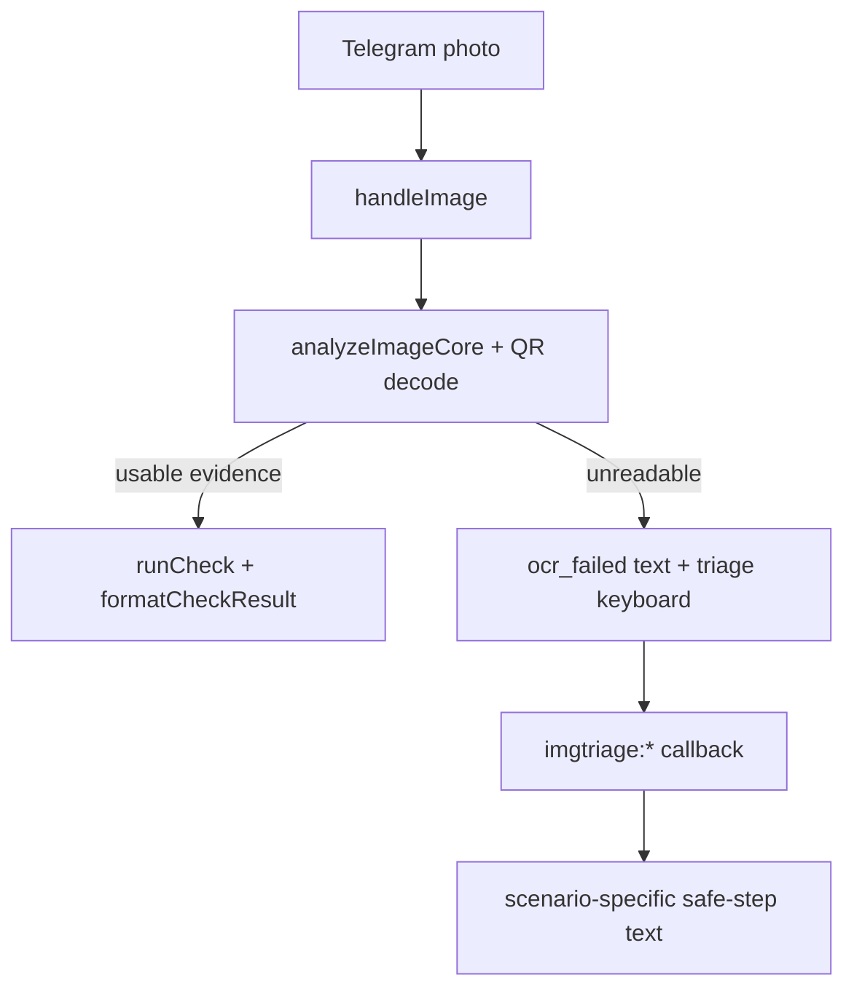

# Design: Telegram Image Fallback Triage v1

## Overview

This feature adds a pure Telegram helper module for unreadable-image triage. It does not change OCR, QR decoding, scoring, or persistence. It improves the user path after image analysis fails.

## Architecture

## Components

- `src/lib/telegram/image-fallback.ts`
  - Owns callback parsing and keyboard/text builders.
  - Provides deterministic safe-step copy by category.
- `src/lib/telegram/handlers/check.ts`
  - Attaches the triage keyboard to unreadable image fallbacks.
- `src/lib/telegram/handlers/misc.ts`
  - Handles `imgtriage:*` callbacks and sends the scenario text.
- `src/lib/telegram/bot-i18n.ts`
  - Holds RU/UZ/EN strings and button labels.

## Correctness Properties

1. Unreadable image fallback must not create a risk check from guessed content.
2. Triage callbacks must acknowledge the callback and send exactly one user-facing response.
3. Triage text must not accuse a specific account/person/channel.
4. The fallback must keep emergency and check-another actions reachable.

## Testing

- Unit test in `bot-qa-matrix.test.ts` for keyboard shape and cautious copy.
- Integration tests in `webhook.integration.test.ts` for unreadable image fallback and callback behavior.
