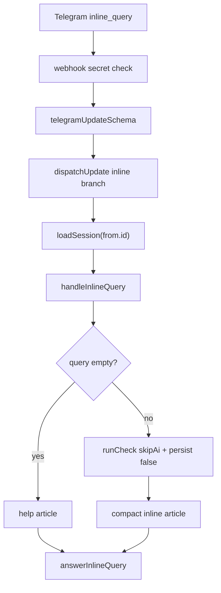

# Design: Telegram Inline Check v1

## Overview

Inline mode adds a second Telegram entry point that does not belong to a chat. The router handles `inline_query` updates before normal message routing, loads the user's session by `from.id`, then delegates to a dedicated inline handler.

## Architecture



## Components And Interfaces

### `src/lib/telegram/router.ts`

Adds `inline_query` to the zod schema and a new handler contract:

```ts
interface InlineQueryCtx {
  userId: number;
  session: Session;
  languageCode?: string;
}

handleInlineQuery(query: string, ctx: InlineQueryCtx, inlineQueryId: string): Promise<void>;
```

`dispatchUpdate` checks `update.inline_query` before `extractTarget()`.

### `src/lib/telegram/api.server.ts`

Adds `answerInlineQuery`, with a minimal `InlineQueryResultArticle` type. The helper follows the same failure policy as other Bot API calls: no throw, `{ ok:false }` on missing token, network errors or non-ok Telegram responses.

### `src/lib/telegram/handlers/inline.ts`

Purely text-based inline handler:

- trims and validates query length;
- returns a help article for empty queries;
- calls `runCheck({ skipAi:true, persist:false, channel:"telegram" })`;
- formats a compact article title, description and inserted message.

### `src/lib/risk/check-core.ts`

Adds optional `persist?: boolean` to `RunCheckParams`. The default remains `true`. Inline mode passes `false` so partial inline typing does not spam analytics/storage.

## Data Models

No database migration is required. Inline preview deliberately does not insert into `checks`.

## Correctness Properties

1. `inline_query` updates never require `message.chat.id`.
2. Inline preview never calls AI.
3. Inline preview never writes to `checks`.
4. Inline messages never include raw sensitive input beyond existing masked `result.display`.
5. Empty inline queries never enter the risk pipeline.
6. Telegram Bot API failures do not throw out of the webhook.

## Error Handling

- Invalid inline update body is ignored by the existing webhook safe-200 path.
- Rate limit returns a help article instead of throwing to Telegram.
- Any unexpected inline handler error returns a generic safe fallback via `answerInlineQuery`.

## Testing Strategy

- Router unit test for `inline_query` dispatch without chat.
- API unit test for `answerInlineQuery` method/body.
- Inline handler unit tests with mocked `runCheck` and `answerInlineQuery`.
- Integration smoke through webhook with a real parsed inline update.
