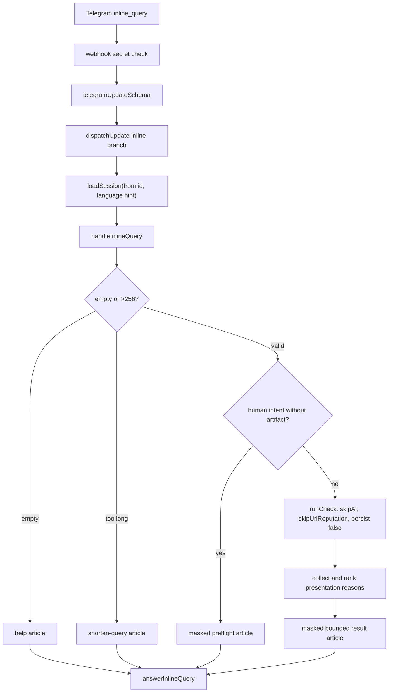

# Design: Telegram Inline Check v1

## Overview

Inline mode is a Telegram entry point without a chat target. It uses the same
deterministic risk rules but disables AI, external URL reputation and check
persistence. Presentation is a separate privacy boundary with exhaustive reason
selection, repeat masking and Telegram-specific size limits.

## Architecture



## Components And Interfaces

### `src/lib/telegram/router.ts`

The router handles `inline_query` before chat-target extraction. It uses
`inline_query.from.id`, accepts the first-contact Telegram language hint and
does not require `message.chat.id`.

### `src/lib/telegram/handlers/inline.ts`

The handler:

- trims input and enforces `MAX_INLINE_QUERY_LENGTH = 256`;
- returns help/too-long/preflight articles without entering the risk pipeline
  when appropriate;
- calls `runCheck` with `skipAi`, `skipUrlReputation` and non-persistence flags;
- re-masks all displayed values through `safeInlineDisplay`;
- fails malformed link-like displays closed to `[link]`;
- compacts article descriptions to 120 characters;
- keeps generated inserted messages within 4096 characters;
- retries Telegram entity-parse failures once using plain text.

### `src/lib/telegram/inline-reason-presentation.ts`

```ts
interface InlineReasonPolicy {
  priority: number;
  evidence: InlineEvidenceMethod;
  limitation: InlineEvidenceLimitation;
}

const INLINE_REASON_POLICY: Record<ReasonCode, InlineReasonPolicy>;
```

The record is exhaustive for all 55 current `ReasonCode` values. The typed
`evidence` field identifies the evidence method/source class; localized copy
names the concrete source and its scope. `presentInlineReason` combines the
selected reason label, evidence statement and limitation.

`rankInlineReasonCodes` removes duplicates, sorts by ascending policy priority
and then by lexical reason code. This makes selection stable when detectors
return reasons in a different order. `collectResultReasonCodesForPresentation`
also adds official-directory or moderated-report evidence derived from result
metadata before ranking.

### `src/lib/risk/check-core.ts`

Inline mode uses `persist=false`, so partial queries do not create `checks`
rows. `skipAi=true` and `skipUrlReputation=true` prevent AI and external URL
provider calls while retaining deterministic local analysis.

### `src/lib/telegram/api.server.ts`

`answerInlineQuery` receives one `InlineQueryResultArticle`. Failures return a
bounded result object rather than throwing query/result content into logs.

## Data And Privacy Model

No migration or inline-specific persistence is required. Query text is used
only for the current request. Presentation never trusts an upstream display as
already safe: result cards and human-intent preflight cards both re-mask at the
last public boundary.

The explanation distinguishes visible rules, official-directory matches,
moderated local reports and any configured source evidence. It never claims
hidden Telegram labels, account age, private complaints, owner identity or
proof of fraud.

## Correctness Properties

1. Inline updates never require a chat id.
2. Inline checks never call AI or external URL-reputation providers and never
   write `checks` rows.
3. Every current reason code has an explicit typed priority, evidence method
   and limitation.
4. Reason selection is deterministic under duplicates and input reordering.
5. Public display values are masked again; malformed links become `[link]`.
6. Descriptions are at most 120 characters and inserted messages are at most
   4096 characters.
7. Empty and too-long queries never enter the risk pipeline.

## Error Handling

- Invalid inline update bodies use the webhook's safe acknowledgement path.
- Rate limiting returns a localized retry article.
- Unexpected handler failures return a localized generic safe article.
- Entity-parse errors get one plain-text retry with the same safe content.
- Logs keep only bounded operational error metadata, never the query or result.

## Testing Strategy

- Router and webhook tests cover dispatch without a chat id.
- API tests cover `answerInlineQuery` shape and safe failure handling.
- Handler tests cover 256-character acceptance and rejection above the limit.
- A 55 × 3 RU/UZ/EN matrix exercises every reason through the real adapter and
  asserts method/source/limitation copy plus 120/4096 bounds.
- Multi-reason fixtures verify priority and lexical tie-break stability.
- Privacy regressions cover preflight/result re-masking and malformed URLs.
- Real Telegram Desktop/Android/iOS visual and insertion QA remains separate
  release evidence; this specification update does not mark it complete.
