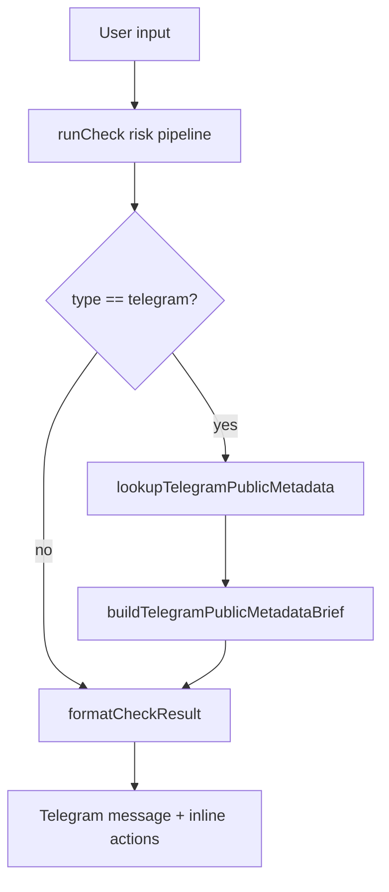

# Design Document

## Overview

Telegram Link & Account Intelligence v2 is a conservative enrichment layer for Telegram targets. It sits after deterministic risk scoring and before Telegram result formatting. The layer adds a short, honest explanation that combines public Telegram metadata, visible risk reasons, and safe next steps.

The feature intentionally avoids Telegram-internal claims that the bot cannot verify. It improves user trust by saying what was checked, what is unavailable, and what the user should do next.

## Architecture



## Components and Interfaces

### Telegram Target Extractor

Implemented in `src/lib/telegram/public-metadata.server.ts`.

Responsibilities:

- Detect public `@username`
- Detect public `t.me/<username>` links
- Detect private invite links
- Detect internal/private links
- Avoid network lookup for private/internal links

### Public Metadata Lookup

Uses `getChatInfo` through the Telegram Bot API only for public usernames. It maps Telegram responses into safe local statuses:

- `found`
- `not_found`
- `unavailable`
- `private_invite`
- `internal_or_private`
- `not_telegram`

### Metadata Brief Builder

Builds a localized text block for `result.explanation`. It may include:

- public chat type/title/access hints
- API limitation wording
- compact visible risk signals
- one next-step sentence

It must not include unsupported claims about account age, hidden scam labels, Telegram report counts, or spam history.

### Result Formatter Integration

The brief is passed through the existing result formatter and truncator. Therefore the first sentence must contain the most important legal/safety limitation.

## Data Models

```ts
type TelegramPublicTarget =
  | { kind: "public_username"; username: string }
  | { kind: "private_invite"; value: string }
  | { kind: "internal_or_private"; value: string }
  | { kind: "none" };

type TelegramPublicMetadata =
  | { status: "found"; username: string; chat: TelegramChatFullInfo }
  | { status: "not_found"; username: string }
  | { status: "unavailable"; username: string }
  | { status: "private_invite"; value: string }
  | { status: "internal_or_private"; value: string }
  | { status: "not_telegram" };
```

DB-backed reputation uses a separate `telegram_reputation_targets` table with hashed identifiers and moderated source metadata. The table stores masked display hints, source type, confidence, first/last seen timestamps and unverified/moderated report counters. It does not store raw usernames, invite tokens, Telegram titles or descriptions.

User-submitted unverified reports are stored only as admin review candidates. Public/user-facing reputation text is shown only for confirmed moderated reports (or future official sources) and includes the source and confidence label.

## Correctness Properties

1. Private invite links never trigger a public `getChat` lookup.
2. Not-found usernames never increase risk by themselves.
3. The rendered brief never claims hidden scam labels, account age, or spam history.
4. Existing deterministic score, level, reasons, known reports, and verified contact fields are unchanged by metadata enrichment.
5. Telegram promo context around a private invite link is preserved as scoring evidence.
6. The first rendered brief sentence contains the safety limitation even after truncation.

## Error Handling

- Telegram API errors degrade to `unavailable`.
- Network lookup failures do not block the base risk result.
- Missing metadata returns the original result unchanged.
- Private/internal links produce a limitation brief instead of a failed lookup.
- Formatter truncation is treated as a UX constraint; brief text is written to keep key caveats first.

## Testing Strategy

- Unit tests for target extraction and metadata status mapping.
- Unit tests for found/not-found/private/internal/unavailable briefs.
- Integration tests for Telegram handler rendering.
- Core risk tests for private invite + betting promo scoring.
- Negative tests for unsupported claims.
