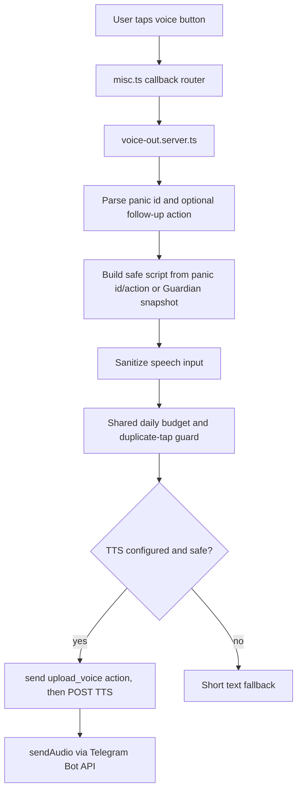

# Design

## Overview

Voice-out/TTS v1 is a server-only Telegram feature. It adds `voiceout:*`
callbacks to SOS and Guardian Angel keyboards and synthesizes only short,
predefined safety scripts. The feature is intentionally not a free-form voice
assistant: it never speaks raw user evidence back to the user.
Follow-up voice buttons can also bind the originating SOS follow-up action so
the audio matches the exact card the user is reading.

## Architecture

## Components And Interfaces

- `VOICE_OUT_CB` defines `voiceout:panic` and `voiceout:guardian`.
- `parseVoiceOutPanicCallback(data)` accepts legacy `voiceout:panic`, scenario
  callbacks `voiceout:panic:<panicId>` and follow-up callbacks
  `voiceout:panic:<panicId>:<action>`.
- `buildPanicVoiceOutText(panicId, lang)` returns short scenario-specific SOS
  audio scripts.
- `buildGuardianVoiceOutText(snapshot, lang)` returns short high-risk guidance
  from safe Guardian metadata.
- `synthesizeVoiceOut(text, userId)` owns provider selection, sanitization,
  rate limiting, timeout and audio-size checks.
- `sendVoiceOutResponse(...)` sends a best-effort `upload_voice` action, then
  Telegram audio or a text fallback. Repeated taps for the same user/text are
  ignored within a short duplicate window.
- `sendAudioFile(...)` in `api.server.ts` sends in-memory audio through
  Telegram Bot API `sendAudio`.

## Data Models

No database table is added. The feature reuses:

- `telegram_sessions.scenario_data.lastPanicId` for SOS context.
- `telegram_sessions.scenario_data.guardian` for safe Guardian metadata.
- Shared `rate_limit_buckets` through the existing `check` scope with a
  `voice-out:tg:<userId>` key prefix.

## Correctness Properties

1. Only `voiceout:panic`, valid `voiceout:panic:<panicId>`,
   valid `voiceout:panic:<panicId>:<action>` and `voiceout:guardian` parse as
   voice callbacks.
2. Voice scripts are derived from safe metadata and contain no raw user
   evidence.
3. URLs, Telegram usernames and long digit runs are removed before TTS.
4. Gemini-like OpenAI-compatible chat endpoints are never used for speech.
5. Missing TTS configuration returns a text fallback without throwing.
6. TTS provider failure returns a text fallback without losing the keyboard.
7. Audio larger than the configured cap is rejected.
8. Daily voice budget denial prevents provider calls.
9. Repeated taps for the same chat/user/text do not create duplicate provider
   calls.

## Error Handling

- Missing context: send an honest no-context message.
- Missing TTS config: send a text fallback.
- Unsafe speech text: do not call provider; send fallback.
- Provider timeout/non-ok/oversized audio: log sanitized status and send
  fallback.
- Telegram `sendAudio` failure: send fallback text with the same keyboard.

## Testing Strategy

- Unit tests for callback parsing and representative RU scripts.
- Unit tests for action-bound follow-up callbacks and duplicate-tap behavior.
- Provider isolation tests for Gemini-like `OPENAI_BASE_URL`.
- Sanitization tests for links, usernames and long digit runs.
- Fallback test for missing TTS config.
- Existing keyboard tests assert the new callbacks stay visible.
