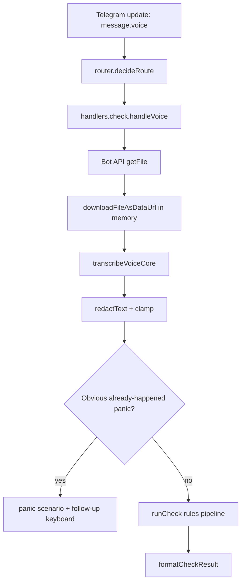

# Telegram Voice STT v1 Design

## Overview

Voice STT v1 adds a privacy-safe Telegram voice note path before the existing rules-first risk pipeline. The implementation keeps audio in memory, uses a provider only for transcription, redacts the transcript, and then calls `runCheck` exactly like text input. AI never decides the verdict.

## Architecture



## Components and Interfaces

### Router

Adds a typed `voiceSchema` and a `RouteAction` variant:

```ts
{ kind: "voice"; fileId: string; fileSize?: number; duration?: number }
```

The router still prioritizes callbacks, commands, active scenarios, captions, visible text, hidden URLs, photos, documents, contacts, and video thumbnails before raw voice transcription.

### Voice Handler

`handleVoice(fileId, ctx, meta)` lives in `src/lib/telegram/handlers/check.ts` next to `handleImage` because it shares the same Bot API download, rate-limit, and check-result rendering concerns.

Responsibilities:

- fetch file metadata with `getFile`;
- enforce the voice size cap before download;
- download only to a data URL in memory;
- call `transcribeVoiceCore`;
- fall back with a calm localized message on failure;
- show a non-message Telegram typing indicator while STT is slow;
- route obvious already-happened emergency transcripts to `/panic` first cards;
- run `runCheck` on redacted transcript on success.

### STT Core

`transcribeVoiceCore(dataUrl, lang, rateLimitKey)` lives in `src/lib/risk/check-core.ts`.

Provider strategy:

- Gemini native audio when `OPENAI_BASE_URL` points to `generativelanguage.googleapis.com`;
- OpenAI-compatible `/audio/transcriptions` when the base URL is not Gemini;
- graceful `null` when no key, unsupported response, timeout, quota, or parse failure.

The transcript is redacted before returning to Telegram code.

## Data Models

```ts
interface VoiceRouteMeta {
  fileSize?: number;
  duration?: number;
  mimeType?: string;
}

interface VoiceTranscriptionResult {
  text: string | null;
}
```

No raw audio, raw transcript, or partial transcript is persisted.

## Correctness Properties

1. Voice messages with no text evidence route to `handleVoice`.
2. Voice captions route to `handleCheck` before `handleVoice`.
3. Voice checks always use `tg:<telegram_user_id>` as the rate-limit key.
4. Oversized voice files are rejected before full buffering.
5. Transcription failure never calls `runCheck`.
6. Transcription success calls `runCheck` with redacted text and `channel="telegram"`.
7. The handler never logs audio bytes or raw transcript content.

## Error Handling

- Missing Telegram file metadata: localized voice fallback.
- Oversized file: localized size-limit message.
- STT missing key/provider failure/timeout: localized fallback with emergency actions.
- Voice STT daily budget overflow: dedicated voice-limit response explaining the cost/spam guard and offering typed summary or emergency actions.
- Shared check rate-limit overflow: existing `rate_limited` response.
- Unexpected exception: existing `generic_error` response.

## Testing Strategy

- Router unit tests for voice routing and caption precedence.
- Handler tests with mocked Bot API and STT core for success, failure, oversize, rate-limit key, slow-STT typing indicator, cache reuse and direct emergency routing.
- STT unit tests for data URL parsing, redaction, Gemini response parsing, and OpenAI fallback response parsing.
- Existing full test suite, lint, build, production smoke after deploy.
