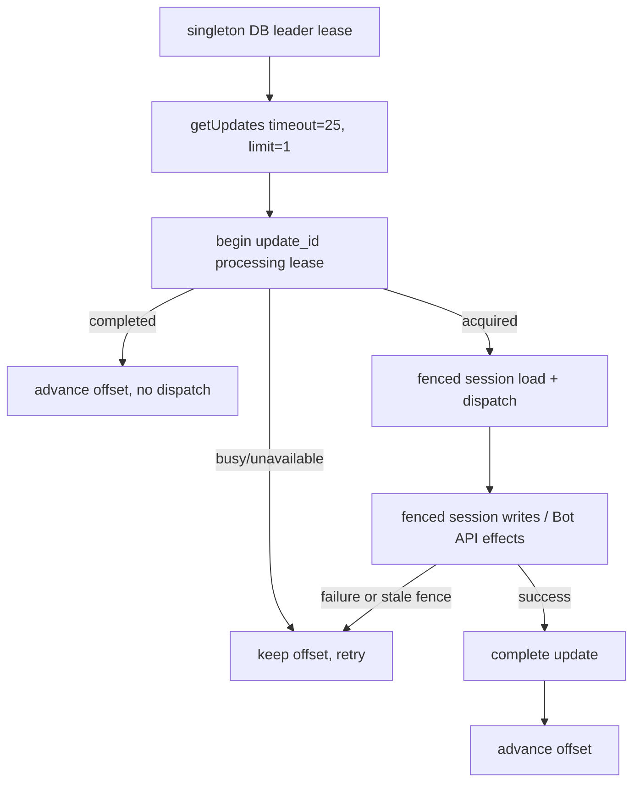
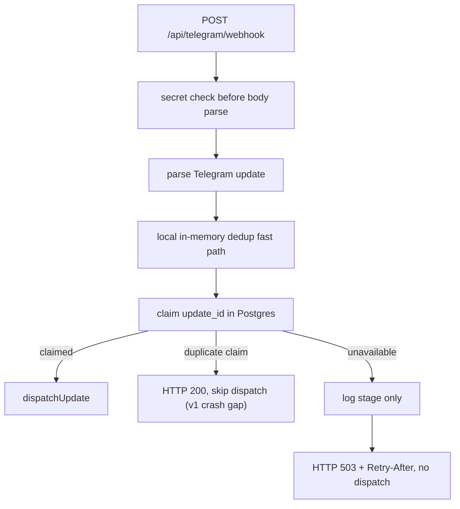

# Design Document

## Overview

Telegram Webhook Shared Dedup v1 was the claim-only predecessor. Its D-072
successor is now implemented locally: `private.telegram_update_leaders` elects
one polling worker; `telegram_webhook_updates` carries processing/completed
state plus leases/fences; `getUpdates(limit=1)` remains the raw payload queue;
and offset advances only after durable completion.

The design intentionally stores no user content. Supabase claim availability is a pre-dispatch integrity boundary: when it is unavailable, the webhook returns a retryable 503 instead of dispatching with only process-local protection.

The historical v1 was retry-claim dedup, not a durable inbox. Its row had no completion state,
so a retry cannot distinguish completed work from a claim whose process crashed
before dispatch. D-070 therefore blocked horizontal processing until the D-072
single-leader successor was implemented locally.

Before production cutover, webhook registration remains pinned to `max_connections=1`, and the
production monitor rejects drift. This reduces concurrent delivery exposure but
is not the ordering mechanism or production acceptance evidence for SG-P1-009.

## D-072 Current Architecture



Only `update_id` and operational lifecycle metadata cross the database
boundary. The raw update remains in Telegram until offset confirmation.

## Architecture



## Components and Interfaces

### `telegram_webhook_updates`

Columns:

- `update_id bigint primary key`
- `first_seen_at timestamptz default now()`
- `expires_at timestamptz`

Access model: RLS enabled, no `anon` or `authenticated` access, `service_role` only.

### `claimTelegramWebhookUpdate(updateId)`

Returns:

- `claimed`: insert succeeded.
- `duplicate`: Postgres unique violation (`23505`).
- `unavailable`: invalid id, client error, missing table, network error, or unexpected exception.

The helper logs only fixed operational stage codes and never database error text.

### `handleTelegramWebhook`

`markUpdateForProcessing` is asynchronous. It checks local dedup first and then attempts the shared claim. The local processed marker is written only after a successful shared claim. `duplicate` skips dispatch, `claimed` dispatches, and `unavailable` returns a retryable 503 without dispatch. Because `duplicate` carries no completion state, this interface cannot recover a previously claimed-but-not-started update.

## Data Models

```ts
export type WebhookUpdateClaimResult = "claimed" | "duplicate" | "unavailable";
```

No generated Supabase type is required in v1; the server helper uses the service-role client and a narrow local row shape.

## V1 Properties And Non-Guarantees

1. A repeated `update_id` with a successful shared claim collision is never dispatched twice.
2. A newly claimed valid `update_id` is dispatched once in the normal no-crash path.
3. A shared-store outage never permits an uncoordinated dispatch and remains retryable.
4. No user content is inserted into the dedup table.
5. Invalid webhook secrets still fail before body parsing and before dedup.
6. Invalid JSON after a valid secret still returns 200 and does not dispatch.
7. The retention function deletes expired dedup rows.
8. Anon clients cannot read or write dedup rows.
9. V1 does not prove handler completion, recover a claimed-before-dispatch crash or serialize session reads across application instances.

## Implemented SG-P1-009 Successor

The preferred privacy-preserving webhook option is a metadata-only leased
lifecycle with `processing`/`completed`, a lease deadline, fencing token,
attempt count and completion timestamp. A completed retry may be acknowledged;
incomplete work must stay retryable and may be reacquired only with a newer
fence. Per-user ownership must be acquired before session load. Because raw
payload persistence is not authorized, the HTTP request cannot be acknowledged
before completion unless an approved delivery mechanism can replay the payload.

The selected implementation is a single-leader `getUpdates` worker with
explicit completion-gated offset and fenced session/effect recovery. Local
application, pgTAP, reset and DB-lint evidence passes. Production remains on the
compatibility webhook until migration, active-leader health, no-drop cutover,
restart and live multi-turn evidence are captured.

## Error Handling

Unique violations are expected duplicate signals. Other database errors are logged with a bounded stage and mapped to `unavailable`. The webhook returns 503 so Telegram retains retry responsibility; it does not acknowledge or dispatch the update locally.

## Testing Strategy

- Unit-test the claim helper for claimed, duplicate, unavailable and invalid-id paths.
- Webhook tests mock the claim helper and verify dispatch behavior for each result.
- Contract/property webhook tests mock the claim helper so existing auth/body invariants stay hermetic.
- Production security smoke verifies anon cannot read the table and service-role can count it.
- Successor tests must cover crash before dispatch, crash during handler, expired
  lease/fence takeover, restart, per-user out-of-order delivery and completed
  duplicate acknowledgement without persisting raw payloads.
