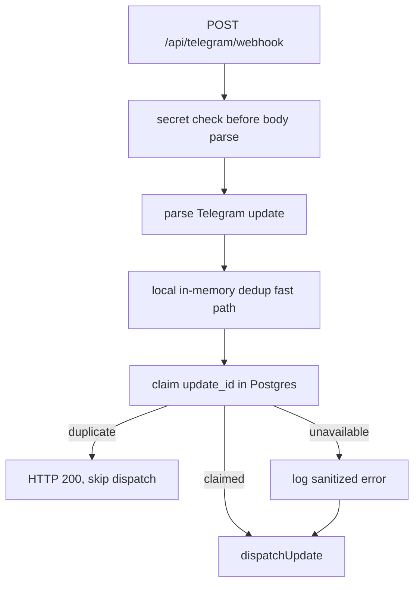

# Design Document

## Overview

Telegram Webhook Shared Dedup v1 adds a small database-backed idempotency layer in front of Telegram update dispatch. The existing in-memory LRU remains as a fast path inside each Node process; a new service-role insert into `telegram_webhook_updates` becomes the shared source of truth across workers.

The design intentionally stores no user content. It accepts duplicate prevention as best-effort during Supabase outages: the bot should not drop urgent user messages if the shared store is temporarily unavailable.

## Architecture



## Components and Interfaces

### `telegram_webhook_updates`

Columns:

- `update_id bigint primary key`
- `first_seen_at timestamptz default now()`
- `expires_at timestamptz`

Access model: RLS enabled, no `anon` or `authenticated` access, `service_role` only.

### `claimTelegramWebhookUpdate(updateId)`

Returns:

- `claimed`: insert succeeded.
- `duplicate`: Postgres unique violation (`23505`).
- `unavailable`: invalid id, client error, missing table, network error, or unexpected exception.

The helper logs only fixed operational messages and sanitized database error text.

### `handleTelegramWebhook`

`markUpdateForProcessing` is asynchronous. It checks local dedup first, writes the local claim, then attempts the shared claim. `duplicate` skips dispatch; `claimed` and `unavailable` dispatch.

## Data Models

```ts
export type WebhookUpdateClaimResult = "claimed" | "duplicate" | "unavailable";
```

No generated Supabase type is required in v1; the server helper uses the service-role client and a narrow local row shape.

## Correctness Properties

1. A repeated `update_id` with a successful shared claim collision is never dispatched twice.
2. A new valid `update_id` is dispatched exactly once in the normal path.
3. A shared-store outage does not prevent dispatch.
4. No user content is inserted into the dedup table.
5. Invalid webhook secrets still fail before body parsing and before dedup.
6. Invalid JSON after a valid secret still returns 200 and does not dispatch.
7. The retention function deletes expired dedup rows.
8. Anon clients cannot read or write dedup rows.

## Error Handling

Unique violations are expected duplicate signals. Other database errors are logged as operational failures and mapped to `unavailable`. The webhook continues because dropping emergency messages is worse than a possible duplicate during a transient outage.

## Testing Strategy

- Unit-test the claim helper for claimed, duplicate, unavailable and invalid-id paths.
- Webhook tests mock the claim helper and verify dispatch behavior for each result.
- Contract/property webhook tests mock the claim helper so existing auth/body invariants stay hermetic.
- Production security smoke verifies anon cannot read the table and service-role can count it.
