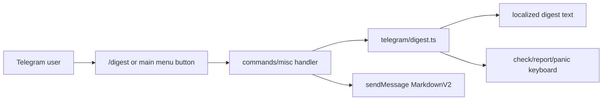

# Telegram Weekly Scam Digest v1 Design

## Overview

The digest is a deterministic Telegram-only feature for now. It adds `/digest`, a main-menu button, and a compact localized digest card with actionable next buttons.

## Architecture

## Components And Interfaces

- `src/lib/telegram/digest.ts`
  - `formatWeeklyScamDigest(lang): { text, keyboard }`
  - `buildWeeklyScamDigestKeyboard(lang)`
- `src/lib/telegram/handlers/commands.ts`
  - handles `/digest`
- `src/lib/telegram/handlers/misc.ts`
  - handles callback `digest`
- `src/lib/telegram/format.ts`
  - adds `CB.digest`
  - adds digest quick action to welcome keyboard
- `scripts/set-bot-commands.ts`
  - adds command menu registration

## Data Model

The first version uses static localized content. No user data is read. No database table is needed.

Future versions may generate a weekly ranked digest from aggregated reports/checks after privacy review.

## Error Handling

- Digest formatting is pure and cannot fail on network or AI provider errors.
- Telegram send failures follow the existing `sendMessage` handling path.
- Callback routing clears the spinner before sending the digest.

## Testing Strategy

- Unit-test digest text length, safety wording, and keyboard callbacks.
- Unit-test `/start` contains the digest quick action.
- Unit-test `setMyCommands` includes `/digest`.
- Existing integration tests cover command/callback routing shape.

