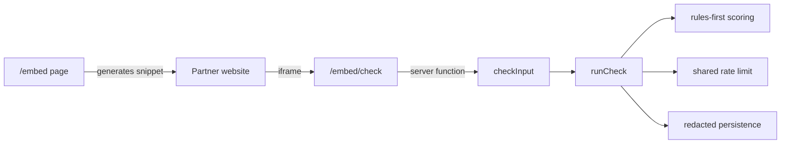

# Design

## Overview

Website Embed Widget v1 adds a distribution surface for Ishonch Guard without
introducing a new public API. The partner-facing `/embed` page generates an
iframe snippet. The iframe points to `/embed/check`, a compact React route that
uses the existing `checkInput` server function. This keeps scoring, shared rate
limits, redaction and persistence in one place.

## Architecture

## Components and Interfaces

- `src/lib/embed-widget.ts`
  - normalizes widget language;
  - sanitizes partner labels;
  - builds iframe URLs and snippets.
- `src/routes/embed.tsx`
  - partner-facing documentation, snippet and live preview.
- `src/routes/embed.check.tsx`
  - iframe runtime route; validates search params.
- `src/components/EmbedCheckWidget.tsx`
  - compact check UI; no screenshot upload in v1.
- `src/routes/__root.tsx`
  - hides global chrome for `/embed/check`.

## Data Models

No new database tables are introduced. The widget uses the existing
`checkInput({ input, type?, lang })` contract and existing check persistence.

## Correctness Properties

1. Unsupported language values always fall back to `ru`.
2. Partner labels cannot preserve HTML markup.
3. Generated snippets include sandbox and strict-origin referrer policy.
4. The widget never serializes raw user input into the generated full-site link.
5. `/embed/check` runs without Header, Footer and global floating controls.

## Error Handling

- Invalid or too-short input shows a local validation message.
- Rate-limit/provider/server errors are converted through the existing
  `safeCheckErrorMessage` helper.
- Meta-intent responses render as information, not as risk results.

## Testing Strategy

- Unit tests for URL/snippet helpers.
- Existing `checkInput` tests continue to validate server-function behavior.
- Production build verifies route generation and bundle integration.
- Browser smoke verifies `/embed` and `/embed/check` render without blank iframe
  content.
